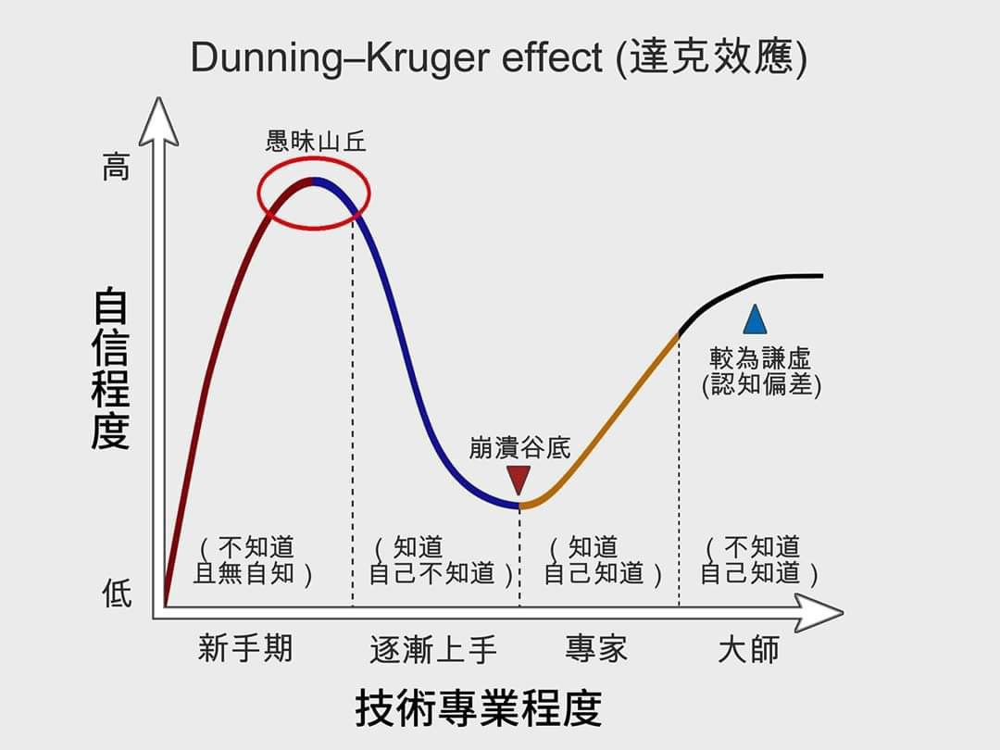

% 飘、傲慢与李亚鹏
% 王福强
% 2025-05-20

## 李亚鹏

咱也不知道真是群众八卦自然传播的，还是有人主动策划的，

李亚鹏妻子的短视频说住小房子，家人在一起就是最好的。

咋说呢？

走下行路的时候

老婆孩子愿意跟着一起走

这一点儿上李亚鹏其实挺幸运的。

毕竟，下跌的过程是很痛苦的

假如家人再搞个落井下石或者雪上加霜啥的

那就更痛苦了

但很多大聪明由此鄙视人家就不对了。

李亚鹏其实是正常人

正常人都会飘

何况他高光时刻那时候

马后炮说人家吃吃喝喝万事大吉的

大多没有李亚鹏的经历

可能更没有自己的高光时刻。

至于说什么存银行吃利息这种，

说明了说话的人对金融和金融产品也没什么了解

## 傲慢

很多人抱怨大厂员工都很傲慢

谈合作的时候都趾高气昂的

其实，这也很正常

从毕业就进大厂，又没经历啥困苦，难道还要跟你共情啊？ 

傲慢很正常啊，你不爽，只是因为他是你的对手方（counterparty），

你在他那个位置，也不见得不傲慢。 
 
修养或者涵养这种东西，少，大多数人都只是普通人。

## 飘

是个人就会飘 

为此[「福强私学」](https://afoo.me/kb)里还有个相关专栏「**愚蠢的自负**」

写的也都是飘的人和事儿

飘很正常啦

达克效应那张图里愚昧之巅不就说这事儿的嘛！

人嘛

说白了就是个经历

年少轻狂、狂妄自大是正常

下落和低谷的时候痛苦沮丧也是正常

主打就一个字嘛！ 

**经历** 或者说 **体验**。

都是正常人

李亚鹏是

说他的人也是

只是不过李亚鹏不太普通

说的人可能比较普通 🤣

人生在世儿

你说说别人，别人说说你

这也很正常 🤣

