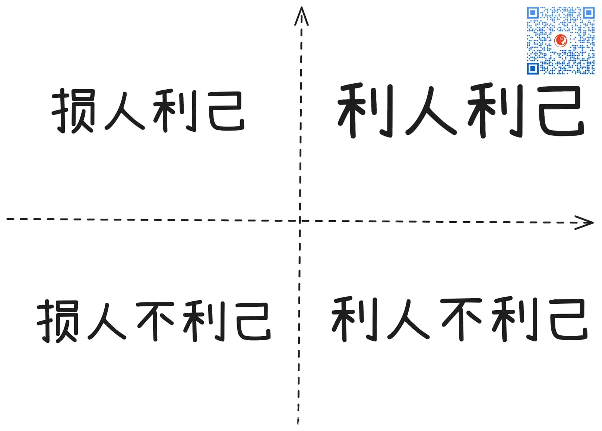

% 你被人死缠烂打过吗？
% 王福强
% 2025-05-28

果总这阵子估计不胜其烦

被一个神经病似的人缠上

有些纠缠不清的感觉

其实，懂得怎么各个渠道搞事儿的主儿

大多数时候他不是真的神经病

更多还是有一定的诉求

**要么为了利益**

比如之前某司有员工跟CEO搞了3年诉讼和纠缠

其实目的应该是期权权益兑现的问题

**要么是为了关注**

就跟婴儿一样

为了得到大人的关注

就大哭大闹 

（成年后还有这种行为就是传说中的巨婴？）

**再要么就是蹭流量**

你的权重更高

蹭你是最快的手段

这个里面最经典的就是我看有个短视频里讲的故事

说是猪跟同伴讲（说到猪，昨天新学了个单词swine，之前只知道pig）

”我能跟老虎（或者狮子）叫板“

同伴不信

这只猪就带他们到老虎跟前

这只猪跟老虎叫板

”我穿上战袍，就能跟你一较高下“

老虎说，”那你去穿吧“

这只猪回去就跑粪坑了打了好几个滚

然后回到老虎跟前

你猜老虎怎么说？

”你赢了“

🤣🤣🤣

最后就是，

**是不是真有“蠢人”到因素在里面呢？**(这里“蠢人”定义是损人不利己)

感觉极其稀少。

如果有，那也是别人戳的主儿？

啥？ 最后一句看不懂？ 

参考[阿朱语录](https://afoo.me/azhu.html)。

