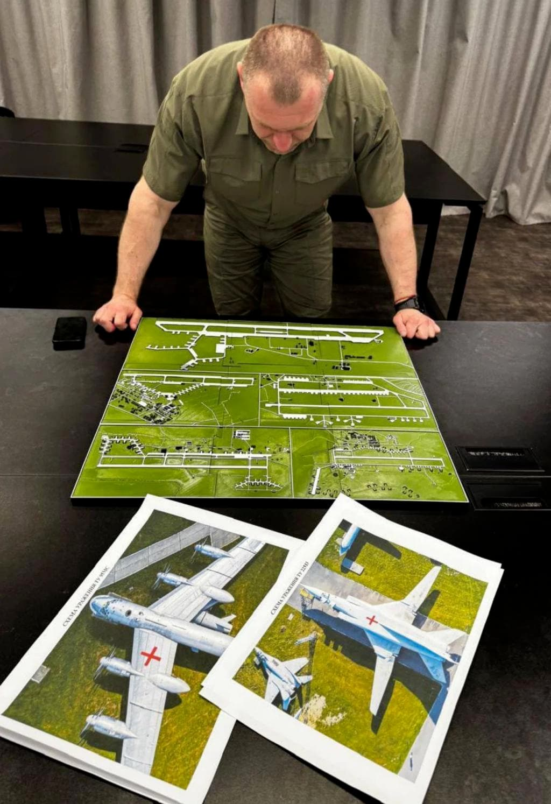
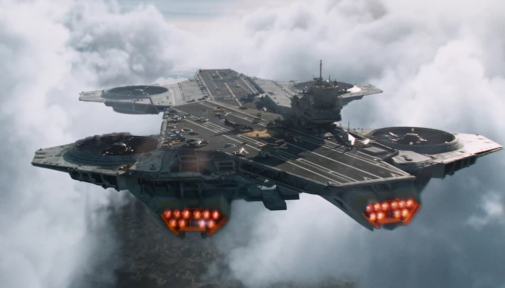
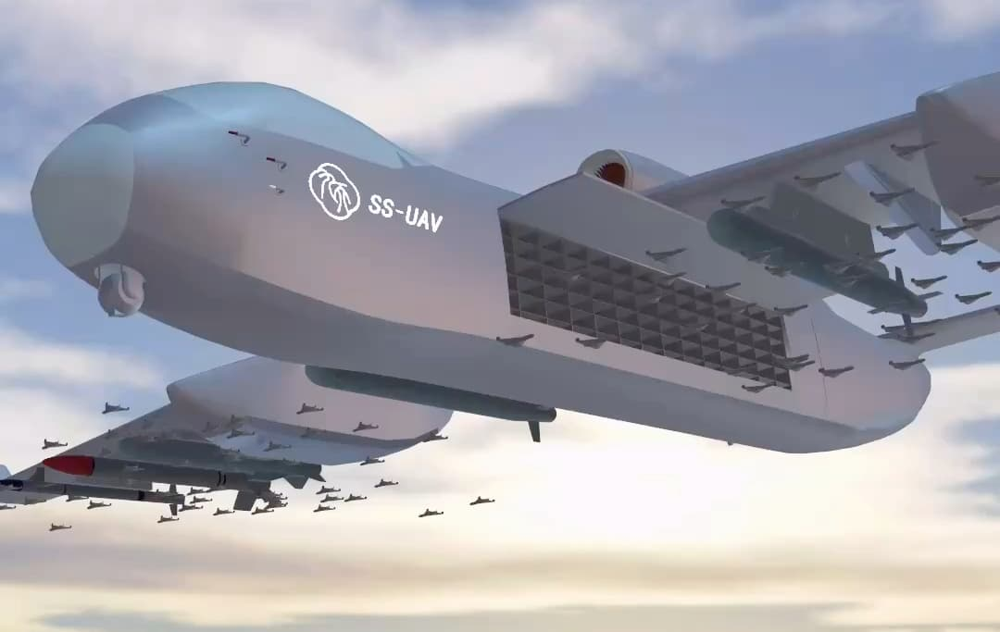
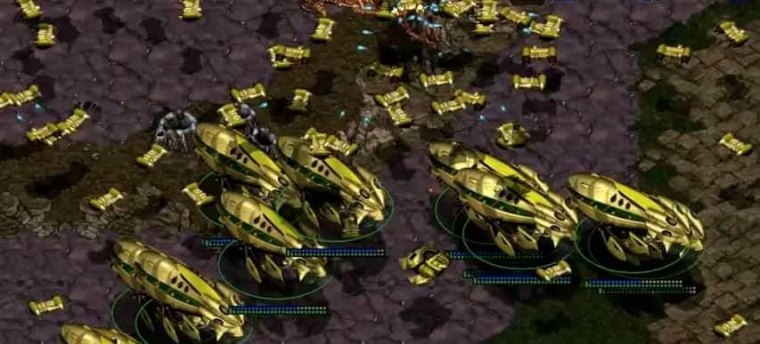
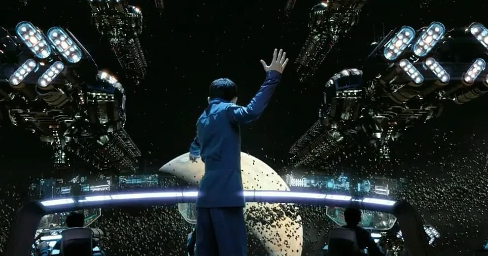

% 深入敌后的无人机开启新的战争纪元
% 王福强
% 2025-06-03

2025年6月1日清晨，乌克兰发起“蜘蛛网（WEB）行动，使用人工智能导航的FPV无人机群，突袭俄罗斯4处军用机场，据说击毁41架包括图22在内的多种类型战略轰炸机。

笔者对俄乌这场战争没有兴趣点评，只对这次战斗/战役中牵扯的意图、规划思路以及牵扯的技术等因素感兴趣，所以，本文主要从这些因素层面说说个人的观点。

## 意图

个人感觉乌克兰的这次行动算是一种“以战促和”

最终目的不是“战”而是“和”

但假如对方不愿坐到谈判桌上来

或者谈判的时候免于自己处于不利地位

show一下muscle还是有必要的

## 规划

具体规划思路和细节不清楚， 据说是规划了一年半

大体情况下应该会：

1. 渗透到4000公里之外的大鹅境内开展活动
2. 租赁当地仓库组装无人机（零件怎么运进去的没细节）
3. 雇佣当地卡车做物流运输（司机不清楚货物细节）将藏有无人机的货柜拉到目标机场附近
4. 释放无人机开始行动
5. 仓库负责人以及渗透特工返回乌克兰境内（应该没有无人机飞手）

猜想，不一定对 😉

还有一种猜想是：

> GPS定位装到无人机上 判断位置到作战圈内 往指定位置飞 图像识别到飞机 投掷炸弹 技术实现很简单

## 成本

战争最后打的还是消耗战，我们可以算算这次战斗投入。

2023年早期，单架FPV无人机成本约为500-1000美元，包括机身、摄像头、炸药和控制系统。

2024-2025年，乌克兰通过本地化生产和规模经济大幅降低成本，平均单架成本降至300-600美元。

而俄罗斯的FPV无人机成本略高，约400-800美元，因部分组件仍依赖进口（如中国、伊朗）。

我们按单机FPV在2025年的平均成本是500美金算， 本次乌克兰投入了117架无人机，那么，总投入（不包含人工、仓储物流等外围成本）一共是 `117 X 500 X 7.2几点汇率`，算下来差不多是**40万人民币**出头。

但相对于给俄罗斯造成的损失差不多有**几十亿**美金之巨。

战争格局彻底改变。

## 技术

### 无人机类型

这里的无人机类型是从无人机的智能角色角度进行分类的， 它们是：

- **FPV无人机**
  - 用于近距离（2-10公里）精确打击，依赖模拟或数字RF信号传输视频和控制指令。
- **侦察无人机**
  - 如DJI Mavic系列，配备OcuSync或类似技术，用于战术侦察和目标定位，传输距离可达7-15公里（FCC标准）。
- **信号中继机**
  - 乌克兰部队常部署中继无人机（如信号增强器）以扩展RF通信范围，尤其在复杂地形或城市环境中。

可见，这三年俄乌战争，无人机战争已经形成了角色与梯队组合。

网上有个飞行拍照轰炸结果的视频，应该就是侦察无人机拍的，我猜。

### AI无人机

这次乌克兰使用的FPV无人机应该是基于AI技术自主攻击性无人机。

乌克兰的AI无人机系统叫Ghost Dragon，即鬼龙， 如果你玩过英雄无敌3，那么应该会很熟悉这个名字，对，就是升级后的鬼族七级兵：

关键技能是😉： 

> 应对EW干扰，乌克兰开发AI驱动的自主导航系统（如KrattWorks的Ghost Dragon），通过视觉导航和目标识别减少对通信的依赖。
> 
> 自主无人机在信号中断时仍可完成任务，成功率从10-20%提升至70-80%。

综合AI无人机的优势和劣势， 乌克兰一方的一张作战规划图可以给我们很多启示：

因为无人机可以承载的有效载荷有限，所以炸弹的攻击必须有效供给目标的关键部位，图上对不同机型的关键部位也做了标记。

其次，AI无人机的优势除了可以自主导航， 另一个主要优势就是可以通过图像算法对目标进行精确识别，这恰好可以满足精确打击的战术需求。

### 光纤无人机

为了屏蔽信号干扰，还有一种无人机叫光纤无人机， 通过在无人机上装配光纤信号转换轴加装光纤， 光纤长度从5公里到20公里不等，因为通信信号走光纤，所以，就不存在信号干扰到问题，但坏处就是，不能“急刹急停”， 毕竟，光纤有些时候也比较脆弱 🤣

一架光纤无人机成本最初差不多要3000-5000美金

2025年，乌克兰计划每月生产1000架光纤无人机（如Magyar’s Birds），通过规模经济进一步降低成本。 现在差不多可以做到1000-1500美金的成本。

俄罗斯光纤无人机依赖我国进口，成本较高（约2500美元/架），且供应链受乌克兰无人机打击（如2025年4月对Saransk光纤工厂的攻击）影响，成本优势不如乌克兰。

本次攻击没有用光纤无人机。

## 畅想

MARVAL漫画里的神盾局有一架天空航母（helicarrier）

将来一定也会出现类似的无人机航母。

当然，都不用将来了，我军好像已经有了类似的无人机航空载具-九天，只不过还是常态飞机形态 😉 

或许可以升级下神族航母形态 🤣

至于说指挥无人机像《安德的游戏》（Ender's Game）里那样战斗，

群控系统的研发应该也是已经在路上了吧，毕竟，现在全国各地无人机烟花秀已经玩了好多年了 🤪

总而言之

无人机已经彻底改变了现代战争的走向。

最后提醒一下，国内5.29日之后不能随便飞无人机了哦，否则罚款2万 🤣

