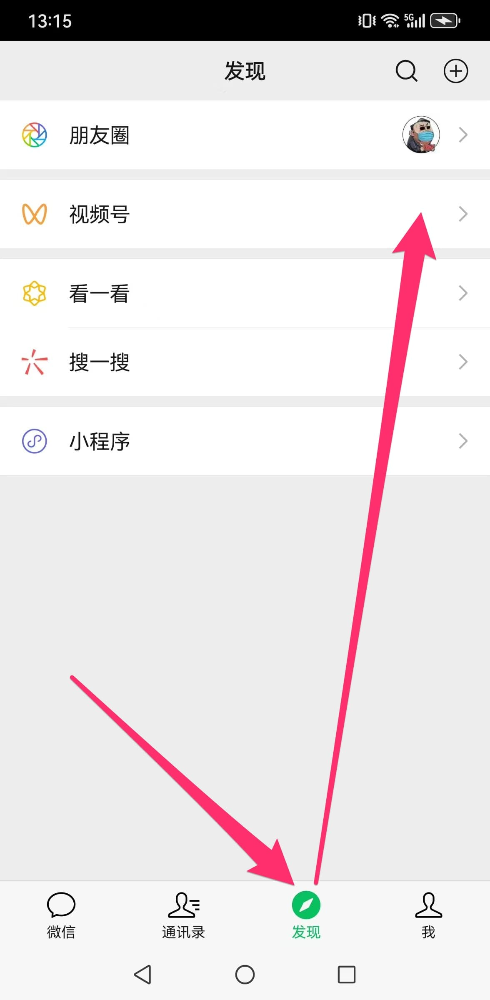
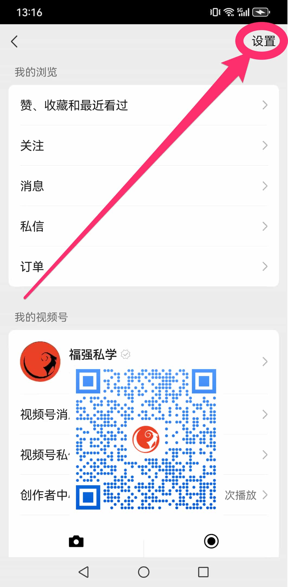
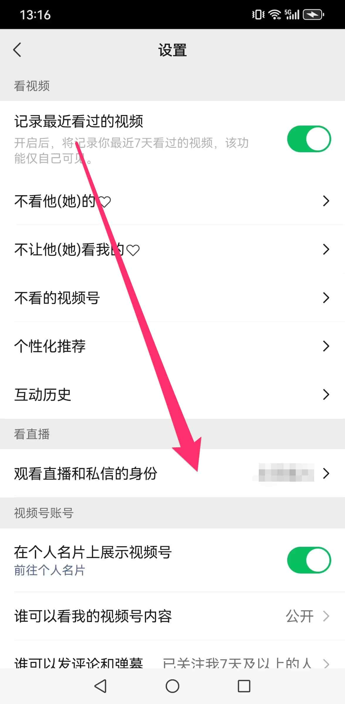
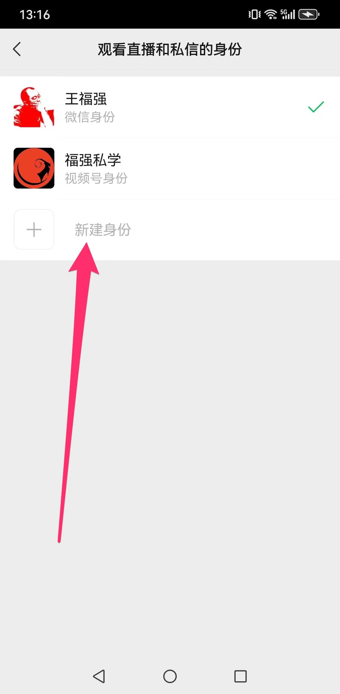
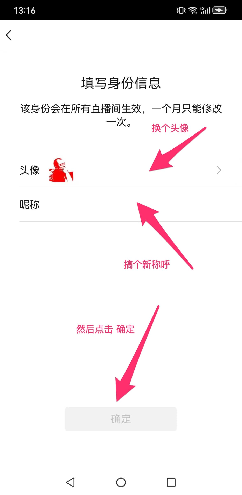

% 观看微信视频号直播，再也不用熟人情怯！
% 王福强
% 2025-06-03

很多人都会因为是熟人的视频号直播而不太愿意进直播间

主播有时候看到熟人进来也会不好意思

其实

视频号里有个设置

穿件魔法衣就可以双方都不尴尬了...

首先，从自己微信的发现页进入视频号：

然后点击右上角的个人视频号图标进入个人视频号主页：

之后，再点击右上角的设置按钮，进入设置页面：

现在，我们在设置页面就发现有个「**观看直播与私信的身份**」，点击进入：

这里默认会有个人微信与个人视频号两个身份， 点击➕号可以新建一个新的身份，魔法隐身就靠它了：

换一个新头像，换一个新昵称，点击确定就可以有一个新身份了：

选中新创建的身份，以后观看任何人的直播，显示的都是这个身份，再也没人知道你是谁，想潜水潜多久都随你 😉

匿名的快乐，是不是又回来了？ 🤣

