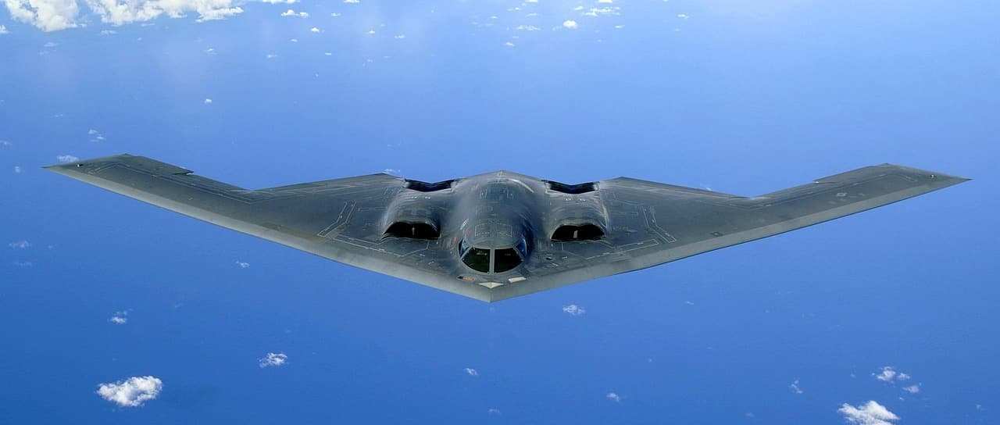

% 战术、战略与B2幽灵
% 王福强
% 2025-06-22

美国这次用3架B2携带6枚GBU-57轰炸伊朗核设施，背后政治纠葛咱就不清楚了，也不想谈，只想谈谈背后的技术与财力。

首先是用的炸弹，叫GBU-57 [^GBU]， 绰号MOP（猫扑？🤣）[^1]， 直径0.8米，长6.2米，总重量13.6吨，通常用B2轰炸机投放，而B2单架次最多只能携带2枚，虽然也可以用B52轰炸机，但被击落的风险会比较大，所以，通常都是B2投放。

这GBU-57一枚粗略估算下来的成本是350万美金，6枚下来，光弹药一项就是2100万美金。

[^GBU]: GBU 是Guided Bomb Unit，制导炸弹单元，这是一个系列， 有GBU-57， GBU-28， GBU-31等。

[^1]: Massive Ordnance Penetrator, 渗透巨炮， 也就是巨型钻地弹。

其次是B2执行一次任务的费用， 每小时13.6万美金， 6架是81.6万美金， 总飞行时长37个小时， 总费用是3019.2万美金

除此之外，我们还没算空中加油机等周边支持系统的费用，这次任务已经至少烧掉了5000万美金了...

所以，啥叫战术？ 啥叫战略？

目标价值足够大的时候，它就叫战略。

目标粒度没那么大，那就叫战术。

比如，以色利敲掉别人某栋楼，最多用用GBU-28，美国自己家可能就100-150万美金一枚（卖给以色列核算下来平均是380万美金一枚，以色列2011年买了100枚GBU-28），而去投放也不需要出动B2这种吞金兽，所以，这种动作最多只能是战术性打击。

假如还想省钱，GBU系列还有GBU-31（南斯拉夫），用的制导套件，每枚才4万美金...

说到底，打仗真就是拼国力

没钱B2这种也真养不起...

前面只是一次任务的费用要烧掉5000万美金，但其实它每年每家还得有4000万的保养费用，综合下来，每架的设计、生产与持有成本至少得40亿美金...

这么贵，也怨山姆大叔这甲方爸爸不靠谱，最初忽悠乙方诺斯罗普·格鲁曼公司（Northrop Grumman Corporation）要买100架，后又缩小到75架，最后却只买了21架，截止2025年，有两家废废了，山姆大叔手里还有19架B2， 但这也很考验家底啊！

每年光持有成本就得7.6个亿美金，还不算日常训练与出任务...

所以，还是得自强啊！

自己不强，连19只小鸟儿都养不起 🤣

