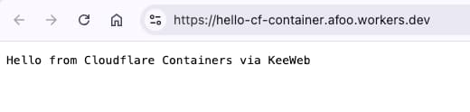

% Cloudflare Containers 避坑指南
% 王福强
% 2025-06-25

今天Cloudflare发布了他们自己的Containers方案， 

我也做了个原理性的介绍视频发到了[「架构百科」](https://jiagoubaike.com/)视频号与[油管频道](https://youtu.be/M9-MeskfF-o): 「**六分钟极速通关Cloudflare Containers**」


建议读到这篇文字的同学可以先去看视频

看完视频之后再回来看文字

因为文字只对玩Cloudflare Containers过程中常见的坑儿进行了记录和分享...


## Docker需预装

如果你使用的是macos系统，建议安装OrbStack， 虽然Docker Desktop也没问题。

总之先要有个本地的Docker编译环境， 因为wrangler deploy的时候会调用docker来编译docker image，本地如果找不到docker支持，那么会报错：

```bash
(base) LuckyJohn💫 ➜  hello-cf-container git:(master) ✗ wr deploy

 ⛅️ wrangler 4.21.2
───────────────────
Total Upload: 81.93 KiB / gzip: 20.23 KiB
Your Worker has access to the following bindings:
Binding                                     Resource
env.KEEWEB_CONTAINER (KeeWebContainer)      Durable Object

Uploaded hello-cf-container (7.05 sec)
Building image hello-containers-with-java-scala:9bab1ce2
[+] Building 1.7s (3/3) FINISHED                                                                                                                                                                                      docker:orbstack
 => [internal] load build definition from Dockerfile                                                                                                                                                                             0.0s
 => => transferring dockerfile: 175B                                                                                                                                                                                             0.0s
 => ERROR [internal] load metadata for docker.io/library/eclipse-temurin:24-jre                                                                                                                                                  1.6s
 => [auth] library/eclipse-temurin:pull token for registry-1.docker.io                                                                                                                                                           0.0s
------
 > [internal] load metadata for docker.io/library/eclipse-temurin:24-jre:
------
Dockerfile:1
--------------------
   1 | >>> FROM eclipse-temurin:24-jre
   2 |     ADD container-java.jar /hello-cf-container.jar
   3 |     EXPOSE 1979
--------------------
ERROR: failed to solve: failed to fetch oauth token: Post "https://auth.docker.io/token": read tcp 192.168.199.247:54738->44.208.254.194:443: read: connection reset by peer

✘ [ERROR] Build exited with code: 1
```


## 网络需畅通

就算装了Docker， 有个东西也要注意，那就是网络。

假如你有登天梯，那么，最好开TUN模式，否则，很可能碰到类似的错误：

```bash
Image does not exist remotely, pushing: registry.cloudflare.com/9b787d029c7992a6dd38a4c749403228/hello-containers-with-java-scala:e62c63b6
The push refers to repository [registry.cloudflare.com/9b787d029c7992a6dd38a4c749403228/hello-containers-with-java-scala]
5dc0fe8b0741: Layer already exists
...
Head "https://registry.cloudflare.com/v2/9b787d029c7992a6dd38a4c749403228/hello-containers-with-java-scala/blobs/sha256:af0ca98f33ef433a4b7855291e197fc872145873dd41c9e3ec6396517ac80202": net/http: TLS handshake timeout

✘ [ERROR] Docker command exited with code: 1
```

## Wrangler版本不能太老

这个坑耗费我时间最久，因为命令行打印信息和滚动速度比较快，最开始我没注意前面的错误信息，导致我认为部署成功了。（而且，信息也确实提示部署成功了，艹！）

所以， 我咋刷新也看不到“部署成功”的containers， 访问理论上应该可以访问成功的路径也不成功（超时或者报错）。

兜了很大一圈子（甚至都去折腾java项目的依赖冲突去了）， 偶然才发现，原来是因为我用的全局wrangler版本过低！！！

因为我给全局wrangler设置了一个wr的alias方便使用，所以并没有用项目定义里的wrangler。

最后`ni -g wrangler@4`（即`npm install -g wrangler@4`）升级后搞定。 （当然，还顺道调换了下node在$PATH环境变量中的位置）

另外就是，假如之前本地的wrangler处于登陆了cloudflare的状态，那么，因为cloudflare containers这个特性太新， 所以，会提示有的权限不够，需要重新登录。

```bash
Uploaded hello-cf-container (3.39 sec)
✘ [ERROR] You don't have 'containers:write' in your list of scopes
...
✘ [ERROR] You need 'containers:write', try logging in again or creating an appropiate API token
```

这时候就是两步走：

1. `wrangler logout` (我是`wr logout`)
2. `wrangler login`（我是`wr login`）

之后运行`wrangler deploy`或者`npx wrangler deploy`就可以成功部署了。

## containerFetch地址要特殊对待

我在前面的视频里有个点说错了，因为最后验证成功之前录的那个视频，所以有一个点说错了（而且视频里还强调了），

那就是， containerFetch的参数在sample代码里演示的样式是没问题的，是我错读了js代码里的comment：

`const response = await containerInstance.containerFetch("https://container/");`

`https://container/`其实就是最BASE的请求URL， 然后再附加请求路径信息，比如：

- https://container/homepage
- https://container/list
- https://container/detail

直接请求路径会报错，比如下面的形式：

- /
- /homepage
- /list
- /detail

所以，这里对于视频中的错误做一个纠正， sorry to bother you 😂

## Container定义要export

```bash
export class KeeWebContainer extends Container {
  // Configure default port for the container
  defaultPort = 1979;
  sleepAfter = "1m";
}
```

Container的封装定义类要export，否则，配置中访问不到。


## scaffolding sucks

cloudflare官方文档给的快速本地常见项目的scaffolding命令不好用（也可能是我本地node环境的问题）， 用了hono的scaffolding也没成功，可能你不一定会遇到：

- `npm create cloudflare@latest -- --template=cloudflare/templates/containers-template`
- `npm create hono@latest worker_project`

这个倒是问题不大，因为我之前写了很多cloudflare workers项目，所以直接copy一个改一改，增加containers相关的配置就可以了。

最后，我用Scala写了个程序打包成container，部署成功之后，运行效果如下：



用的Dockerfile也贴下供参考（偷懒，直接把Scala项目的onejar拿过来打包的）：

```Dockerfile
FROM eclipse-temurin:24-jre
ADD container-java.jar /hello-cf-container.jar
EXPOSE 1979
CMD [ "java", "-jar", "/hello-cf-container.jar"]
```

## Last but not least

因为还是beta阶段，所以，大家在玩的时候难免会遇到这样那样的问题，都算正常。

分享以上坑获 [^1]， 希望大家可以省去去这些踩坑的时间，毕竟，时间就是生命 🤪

[^1]: 我去，双关了，哈哈哈， 这里也有一些[《坑获》](https://afoo.me/books.html)

