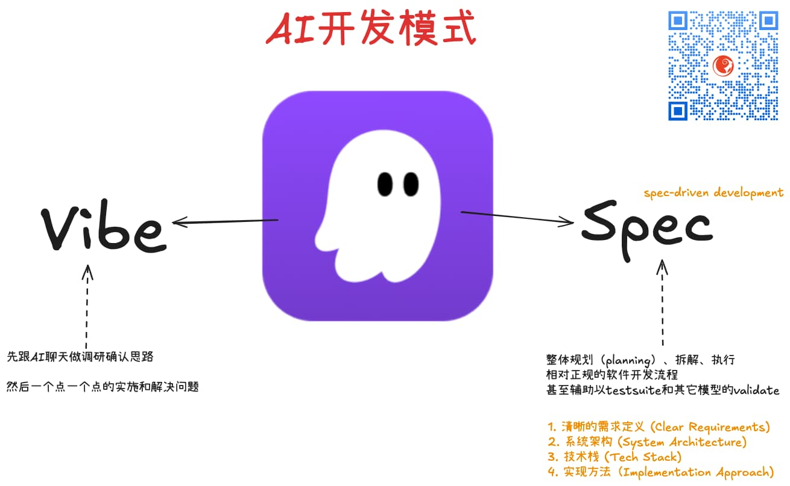

% 福强的本周AI热点回顾与简评
% 王福强
% 2025-07-19

关注「福强私学」，紧跟AI前沿。

## AI 理论

### Mixture-of-Recursions

Google DeepMind刚发布了一个新的LLM模型架构叫 Mixture-of-Recursions

可以获得两倍推理速度的提升，而且降低训练的算力与一半的KV cache内存需求。 

感觉有潜力干掉Transformer架构？

Paper来源：<https://www.alphaxiv.org/abs/2507.10524>

## AI 模型

### Kimi-K2
  - 这个算上周的，不过可以再提一下，对于Claude Code原版访问有难度的同学，K2带来的是类似当初国内的 Deepseek(R1) 时刻。

### Gemini Embedding

国内可能更推荐Qwen3的Embedding模型。

### Voxtral

Mistral（法国公司）新推出了一个ASR模型： Voxtral，类比OpenAI 的 Whisper large v3

据说比v3又快又便宜，感兴趣的同学可以试用看看🤪

## AI 产品

### Kiro

AWS新推出了他们家自己的AI IDE - Kiro，类似于亚马逊家的Cursor。

个人试用了下，it works 🤣

其实还是因为Claude4能打 😉

不过， Kira把两种典型的开发模式显性的在产品中表现出来，这个设计还是值得肯定的。

### Claude Directory

Claude新搞了个一键接入第三方服务的[目录服务](http://claude.ai/directory), 通过将Notion、Canva、Figma等第三方平台统一接入自己的产品，大大提高了用户使用Claude客户端的便利性。

当然，底层肯定还是基于Claude最早提出的[MCP](https://jiagoubaike.com/posts/mcp)。

### Grok 数字人

Grok推出了waifu风格的数字人，好像看到了新瓶里的旧酒...

游戏 + AI，a new remix !

感觉电视可以给新终端腾地方了 🤣

或者电视自己AI升级？

### AWS推出S3 Vector

- https://www.youtube.com/watch?v=Wp0LKeZhcTM
- https://aws.amazon.com/blogs/aws/introducing-amazon-s3-vectors-first-cloud-storage-with-native-vector-support-at-scale/

通过引入新的bucket类型，S3 Vector允许用户基于S3对象存储做向量存储和检索。

同一领域，还有个产品叫LanceDB，都归属于Lakehouse领域。

### ChatGPT agent

OpenAI发布它家自己的类似Manus的通用智能体产品。

## AI Infra（AI基础设施）

### facebook 建设 1GW+ 超级算力集群

这个1GW+超级算力集群叫普罗米修斯（Prometheus），而且，Meta声称，多个1GW+的算力集群也在规划中。其中，一个叫Hyperion（海伯利安）的超级群预期可以扩展到5GW。

1GW+什么概念？ 

马斯克 30 万张卡的集群功耗应该是 200-300 兆瓦，1GW相当于是其4-5倍。

哎， 真的是马太效应越来越明显啊，强者恒强。、

信息源：https://www.facebook.com/watch/?v=2300161320399228&rdid=QRq1A78367crtsaN

## AI 相关 推荐阅读

- https://www.builder.io/blog/claude-code
- https://glaforge.dev/talks/2025/07/16/ai-agents-the-new-frontier-for-llms/
- https://medium.com/@giuseppetrisciuoglio/claude-code-one-month-of-practical-experience-a-guide-for-software-architects-and-developers-e52b74236d1a

