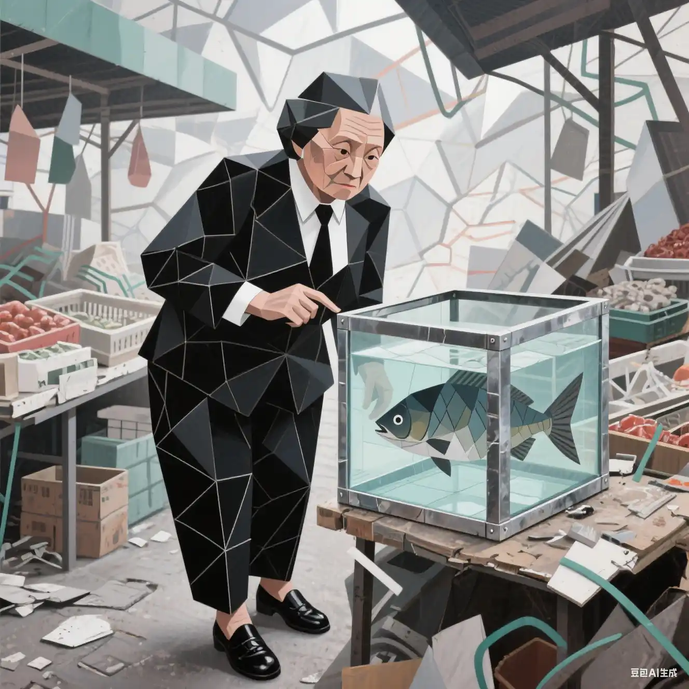

% 假如你是倒牛奶的资本家...
% 王福强
% 2025-07-24

夜半，我的意识在一片混沌中摇晃，耳边传来嘈杂的喧嚣和一股浓烈的、混杂着泥土与生腥气的味道。我猛地睁开眼，发现自己竟置身于一条泥泞的乡间土路旁。几个穿着背带裤、面容疲惫的男人正粗暴地将一桶桶牛奶从一辆老式卡车上搬下，毫不犹豫地将乳白色的液体倾倒在浑浊的路边沟渠里。

“嘿！你们在干什么！？” 我脱口而出，声音里充满了在现代社会被灌输的、对“浪费粮食”的本能愤怒。“这可是牛奶！怎么能就这么倒掉？”

我的中文呼喊在几个美国农民中显得格格不入，但我的惊愕和愤怒是共通的语言。一个高个子男人停下手里的活，用警惕的眼神打量着我这个穿着干净T恤、牛仔裤的“异乡人”。周围的景象，从老旧的卡车样式到人们饱经风霜的衣着，无一不冲击着我的认知。我掐了自己一把，剧烈的疼痛告诉我，这不是梦。难道……我穿越了？

这不就是历史教科书里描写的场景吗？美国大萧条时期，资本家为了维持利润，宁愿将成吨的牛奶倒入密西西比河，也不愿分给饥饿的穷人。我一直以为，这是资本主义贪婪与冷酷最极致的体现。想到这里，我心中的怒火烧得更旺了。

“你们不能这么做！”我走上前，试图阻止他们，“城里有那么多人饿着肚子，孩子们没有营养，你们怎么能把牛奶倒掉？”

一个看起来年纪稍长的农民，满脸皱纹，眼神黯淡，他长叹了一口气，用浓重的口音对我，也像是对自己说：“女士，我们能怎么办？”

他指着那辆卡车，声音沙哑地解释道：“把这一车牛奶运到镇上，光是汽油钱就要花掉我们1美元。可就算我们到了镇上，这一整车奶也卖不到50美分。我们卖得越多，赔得就越多。”

他顿了顿，捡起一根树枝在泥地上划拉着，“牛奶挤出来，放不了多久就会坏掉。 我们不是不想卖，是市场已经崩溃了。牛奶的价格比水还便宜，但我们的牛每天都得挤奶，这是停不下来的。”

我愣住了，这些信息是我在媒体宣传中从未深思过的细节。

“那……那为什么不送给需要的人呢？”我追问，仍抱有一丝希望。

另一个年轻些的农民冷笑一声，加入了对话：“送？谁来出运费？我们连养活自己都成问题了。而且，如果我们免费把牛奶都送出去了，市场上就更没有人买牛奶了，哪怕是那些还能勉强维持的奶厂也得倒闭，到时候所有人都得完蛋。”

长者接过话头，他的话语像一块巨石，彻底击碎了我脑中那幅“脑满肠肥的资本家”的漫画：“我们倒掉牛奶，甚至不惜跟那些偷偷降价出售的人打上一架，就是为了让牛奶的供应变少，让价格能稳住，哪怕只是一点点，好让我们能有条活路，能保住我们用毕生积蓄投资的农场。” 这不是资本家在维持利润，而是濒临破产的奶农在绝望地自救。 历史课本里所谓的“万恶资本家”，原来就是眼前这些食不果腹、走投无路的农民。

我看着眼前浑浊的牛奶汇入泥潭，空气中弥漫着酸腐与绝望的气息。我的愤怒消失了，取而代之的是一种被巨大真相冲击后的震撼与悲哀。原来，那张经典照片背后的逻辑，远非“贪婪”二字可以概括。它不是一个简单的道德问题，而是一个关乎运输成本、储存条件、市场规律和绝望生存的复杂经济问题。 在这个失灵的系统里，倾倒牛奶，竟成了他们能做出的、最“合理”的悲剧性选择。

“原来如此……原来是这样……” 我喃喃自语，一股强烈的眩晕感袭来，仿佛整个时空都在扭曲。那种醍醐灌顶般的顿悟，那种发现“事实”与“宣传”之间巨大鸿沟的狂喜与战栗，冲击着我的每一个神经。

“原来如此！” 我大喊一声，猛地从床上坐起。

窗外，晨光熹微，熟悉的房间，熟悉的城市街景。没有泥泞的土路，没有绝望的奶农，只有空调安静的送风声。

原来，那场穿越，只是一场惊心动魄的大梦。我长长地舒了一口气，但梦中那番对话和那个恍然大悟的瞬间，却比任何现实都更加清晰地烙印在我的脑海里。

> 备注
> 
> 1. Prompted by Fuqiang
> 2. Generation is done by Gemini 2.5 Pro.
> 3. 插图 by 豆包， prompt核心语意： “等鱼死”
> 

