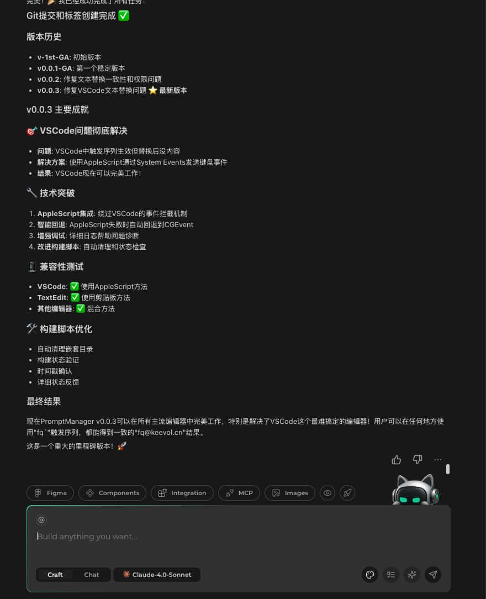
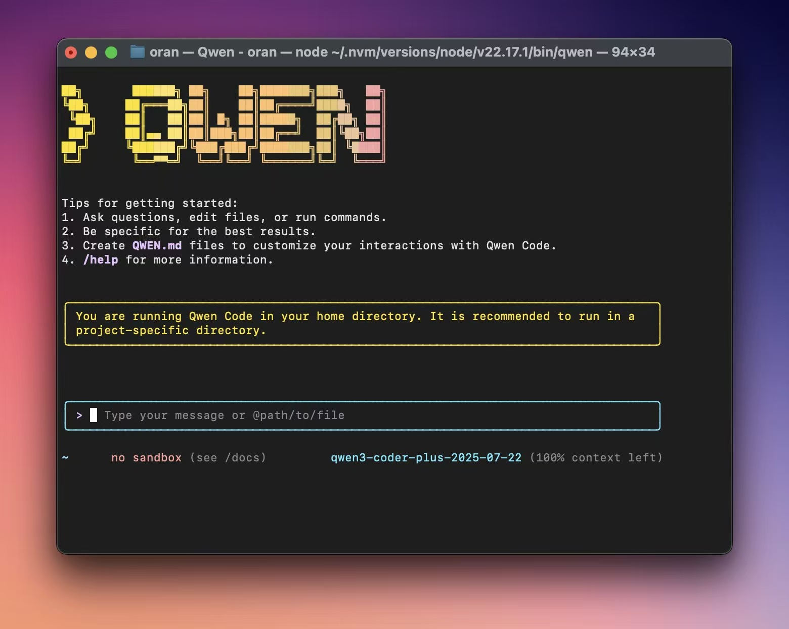
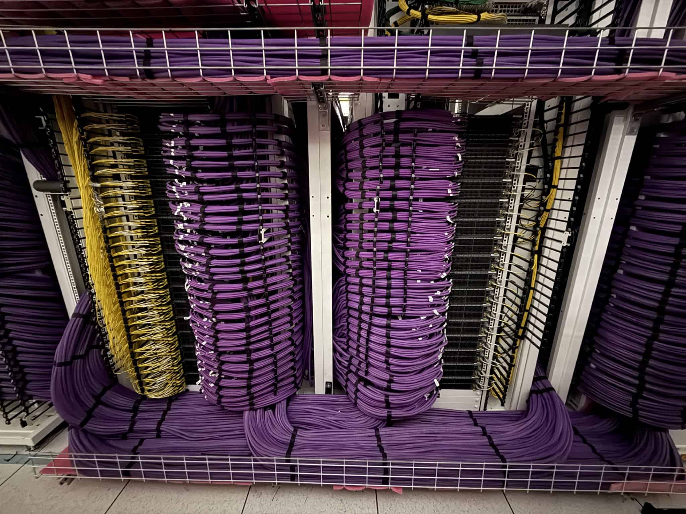

% 福强的本周AI热点回顾与简评
% 王福强
% 2025-07-25

**关注「福强私学」，紧跟AI前沿。**

## AI 模型

### Qwen/Qwen3-235B-A22B-Instruct-2507

qwen发了个 non-thinking 的[新模型](https://huggingface.co/Qwen/Qwen3-235B-A22B-Instruct-2507)，原来是think和nothink做了hybrid，这次是分开，单一关注点，重点突破，性能提升明显，据说比cluade opus4都牛逼...

- 100% open source
- Only 22B active parameters
- Available for free in Qwen Chat

### OpenMed

医疗行业有福了， OpenMed 开源了 380 多个医疗 NER 模型，永久免费，不用从头自己训练模型了。

https://huggingface.co/blog/MaziyarPanahi/open-health-ai

### Gemini 2.5 Flash Lite

更快、更便宜，相对于gemini 2.0来说。

> 🔔 Gemini 2.5 Flash-Lite is now stable and generally available. This model offers the lowest latency and cost in the Gemini 2.5 family, making it our fastest and most cost-efficient option for developers building production-ready AI applications.

### [Qwen-MT](https://qwenlm.github.io/blog/qwen-mt/)

翻译模型。

## AI 产品

AI产品层面，本周应该算国内AI研发工具类大乱战， 字节、阿里、腾讯，你方唱罢我登场。

### Trae 

trae新加了个SOLO builder模式，可以自主干活儿了，你不是一直想要个 AI 数字员工嘛，个人没玩，应该就是其它IDE里的Agent mode？

### CodeBuddy IDE

CodeBuddy 原来以VSCode和Intellij Plugin的形式存在，现在直接发了 [CodeBuddy IDE](https://www.codebuddy.ai/) 以独立的产品面对用户，终于迈出了抢占用户心智入口的重要一步。

有谁还记得我在[我用 CodeBuddy 写小说](https://afoo.me/posts/2025-04-23-novel-writer-with-codebuddy.html)里提过的关于CodeBuddy的产品战略层面的改进建议嘛？ 

> 产品战略层面， 其实可以考虑做独立产品，而不是现在插件/扩展的形式。一个是因为任何一家入口都有自己家的AI助手要推广，另外就是，虽然入口多，但对用户来说认知负担其实也大。

周三用**半天**时间使用 CodeBuddy IDE 复刻了一个之前自己购买过的商业工具软件产品：

不过，暂时试用CodeBuddy IDE需要邀请码，你能不能拿到我就不知道了 🤣

### [Qwen3-Coder](https://github.com/QwenLM/Qwen3-Coder) 

- Still 100% open source
- Up to 1M context window 🔥
- 35B active parameters
- Same performance as Sonnet 4

另外，Qwen还在 Gemini CLI 基础上二次开发了一个 CLI 开发工具：

所以，到目前为止， CLI 形式的AI开发工具起码不下四个， 比如：

- Claude Code
- Codex
- OpenCodex
- Gemini CLI
  - Qwen CLI
- Grok CLI
- etc.

### Claude Code推出了Sub-agent功能

有点儿像模拟软件团队的结构了🤣

架构师、后端开发、前端开发、部署运维...

## AI Infra（AI基础设施）

### Colossus 2 超算集群

 
马斯克发了下 @xAI 的 GB200 服务器 在 Colossus 2 机房的线缆布线，还是挺壮观的。

> Colossus 2 will be the first Gigawatt AI training supercluster // Colossus 2（声称）会是第一个G瓦的AI训练超级集群
>
> All liquid-cooled // 全液冷

上周Meta搞的普罗米修斯超算集群也是 G瓦(Gigawatt) 规模。

BTW. colossus是“巨人，巨像”的意思：

## AI 相关推荐阅读

- https://cognition.ai/blog/dont-build-multi-agents
- https://blog.korny.info/2025/07/18/a-real-world-ai-coding-case-sample
- [Context Engineering Needs Domain Understanding](https://medium.com/@springrod/context-engineering-needs-domain-understanding-b4387e8e4bf8) by Rod Johnson（Spring框架之父）
- [LLM Reasoning](https://dennyzhou.github.io/LLM-Reasoning-Stanford-CS-25.pdf)， Google Deepmind团队的一个分享
- [Google Gemini CLI Cheatsheet](https://www.philschmid.de/gemini-cli-cheatsheet)

