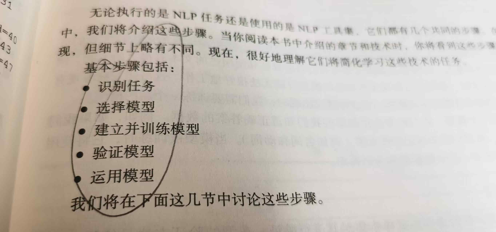
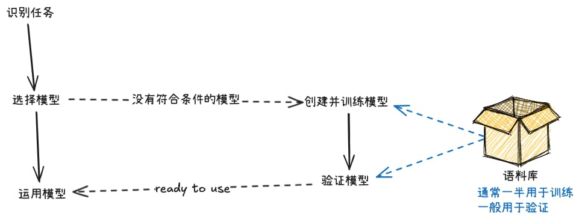
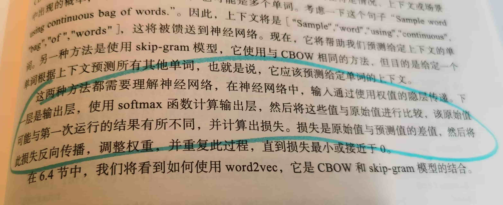

% 使用AI的基础思路（Still stands）
% 王福强
% 2025-07-26

首先得先感谢机械工业出版社的每月作者福利哈

今天花半天把这个月的福利书籍扫完了

虽然内容很基础

相对于大模型时代，书中的内容和技术栈可能也是上个AI时代的产物

但开卷有益啊

有些点还是很有启发的

比如，其中谈到自然语言生成(NLG)

我就顺道更新了[「福强私学」里相应的基础概念解析](https://kb.afoo.me/business/%E5%95%86%E4%B8%9A%E5%AD%A6%E5%BE%92/0018-token-business/)，从而也理顺了自然语言处理领域三个概念之间的关系：

> NLP 包含了 NLU 和 NLG

而在此之前，我也只是提到了NLU和NLP，但总觉得缺了点儿啥，结构不平衡似的，这回平衡了。🤣

再比如，其中谈到NLP任务和应用开发的基础步骤：

其实，到了今天大模型时代，这个思路和步骤也是依然成立的，不过，这个阐述过于线性了，我给演绎了一下，使它更具结构化：

关键步骤可以压缩成三步：

1. **识别任务**，其实就是搞清楚要用AI或者NLP干什么事情；
2. **选择模型**，针对具体任务和场景，哪个或者哪些模型更适合，比如像今天你要做RAG和AI知识库，那可能用Qwen3 Embedding是一个比较合适的选择。 但假如没有合适的模型怎么办？ 那就是旁路，自己训练模型，而自己训练模型两个关键点： 一个是要有合适的语料库，一个是模型训练后要验证。
3. **运用模型**，这个就不用多说了吧，认清了任务又选对了模型，剩下的就是“干就完了”。

简单吧？ 当然简单，大道至简嘛 🤪

再再比如， 关于神经网络的基础原理，在今天大模型的架构里也依然有一席之地，而且还是关键路径上的一席之地：

啥？ 什么书？

《Java自然语言处理》 

主要是想看看有没有希望 Make Java Great Again！😂

Just kidding, 纯粹为了分享下AI应用开发的基本思路和基础步骤那部分内容。

