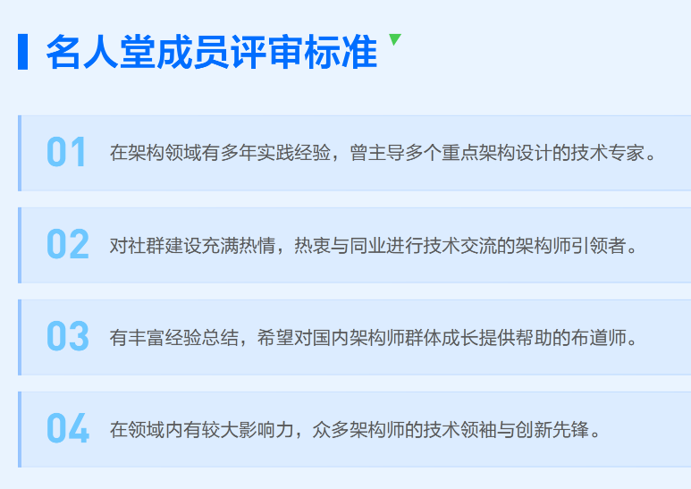

% 高端的‘师’材，往往只需要最朴素的碰认
% 王福强
% 2025-08-16

> “高端的食材往往只需要最朴素的烹饪方式”

哦，不好意思，走错片场了...

下面才是主片场...

---

很多年前，嗯，真的是很多年前，某科技公司CTO（后来做了CEO，再后来，退休了）在加入某个组织后，表达了自己之前孤独的感受，加入了匹配的组织，才发现还有那么多通行者，原来自己并不孤独。

小强有一天来找老强，说他工作上遇到瓶颈了，应该怎么办？

老强推荐他加入了一个社群，后面就很少听到小强的抱怨了，发现他玩得不亦乐乎。

啥？ 你也想加入？

那你得先有个心理准备，虽然这个社区不像前面CTO加入的那个组织那样，年费一万左右来筛选会员，但也不是对要加入的成员没有要求的...

> 阿难对佛祖说：“我喜欢上了一女子。”
> 
> 佛祖问阿难：“你有多喜欢这女子？”
> 
> 阿难说：“我愿化身石桥，受那五百年风吹，五百年日晒，五百年雨淋，只求她从桥上经过。”
> 
> 佛祖继续问道：“会有多喜欢，可是一见钟情便倾心一世，可是不问回报而付出等待。”
> 
> 佛祖又说：“阿难，某日等那女子从桥上经过，那也便只是经过了，此刻你已化身成了石桥，注定只与风雨厮守。这一切你都明白，仍旧只为那场遇见而甘受造化之苦。阿难，你究竟有多喜欢那从桥上经过的女子，令你舍身弃道，甘受情劫之苦。”

当然了，五百年的门槛有点儿高，除了王九他哥，可能极少有人能够得着500年的门槛...

好在，假如你真想要加入这个社群，只要有五年的相关专业领域背景就可以了：

> 如果你有5年以上架构设计经验，渴望找到能聊透技术、共破难题的伙伴，不妨试试迈出这一步：
>
> 

对，这个社区就是腾讯云的架构师同盟。

扫描下方二维码，提交你的技术履历，经审核通过后，就能正式加入这个汇聚行业精英的圈子。 

当然，我没决策权，只有举荐权 [^1]，老...老架一路，就只能帮别人举荐举荐了🤪

[^1]: "在察举制的体制下，到了东汉后期，那些郡国地方官员，几乎完全把持了举荐人才的权力。就算是皇帝，也只能从他们举荐的人才中，进行下一步的挑选任命。" 

年轻的架构师才俊们，你们才是架构师的未来！

技术的道路上，最珍贵的是同频者的陪伴。  

在腾讯云架构师技术同盟，有人与你并肩拆解复杂问题，有人与你分享前沿思考，有人与你一起把技术影响力做大。  

如果你也想告别「技术孤独」，和一群懂技术、敢创新的架构师同行，我们在这里等你~~~

来一起把技术聊透，把难题攻克，把路走宽！

**高端的（架构）师材，只有这里才能碰撞和认识**。

