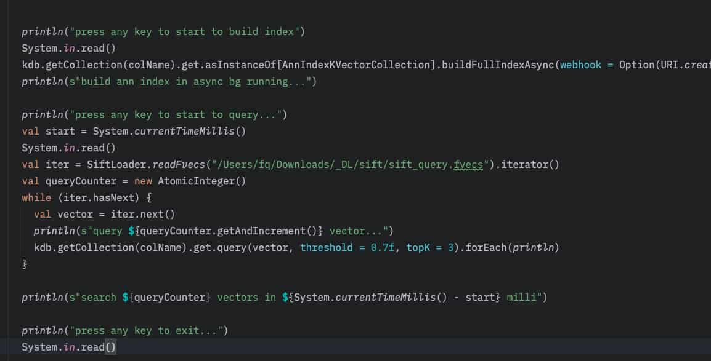

% KVectors 向量数据库基本成型！
% 王福强
% 2025-08-22

从这个月初（2025年8月初）开始筹划和编写KVectors的第一行代码，今天用[Sift的一百万向量数据集](http://corpus-texmex.irisa.fr/)对AnnIndexVectorCollection做了个简单的测试（10亿那个数据集太大，我这2019年的老MacbookPro肚量不够，放不下🤣），怎么说呢？

构建索引的速度出乎我的意料，可能之前也没有具体的标准，反正不到六分钟， 100万向量就压缩和索引完成：


我在设计构建索引的触发方法上添加了webhook支持， 这样，大数据集的索引构建可以异步在后台跑，跑完了可以选择发个通知，同时，为了省事，也可以直接上线构建完成的新索引（生产环境建议验证索引后再手动enable新索引）：

```scala
def buildFullIndexAsync(enableAfterBuildSuccess: Boolean = true, webhook: Option[URL] = None): CompletableFuture[Void]
```

反而查询结果更出乎我意料，mmd，居然 100+ 毫秒的时延， 不应该啊！ 虽然我也没怎么正经的做性能测试：


想了下才发现问题在哪儿，原来是每个查询向量的加载牵扯了文件系统的IO，而我把这些时间也给平均进去了，怪不得呢...（果然没正经做测试😂）




至此， KVectors分别支持了三大类Vector Collections: 

- InMemoryNoIndexVectorCollection
- GeneralNoIndexVectorCollection
- AnnIndexVectorCollection

基本满足了测试、小数据量以及大规模向量数据的索引与相似性检索需求。

KVectors的定位就是只做向量数据库：


之所以定位就是因为，我始终认为大模型与算力的生意是大厂拼杀大战场，跟SMB没啥关系，SMB要么做AI应用，要么就找个能抓住的点。

另外，为什么用Java/Scala写呢？

也是因为Java Vector API经历了七八轮incubator，也该进入正式发布了，基于Java Vector API，我们可以充分利用现代CPU的SIMD特性，极大加快向量相似性计算。

除此之外， KVecvtors还用了一些业界比较先进的思想和实践，比如HNSW和DiskANN算法

这其实也是为啥我能不到一个月就搞定这个产品原型的原因了，站在了巨人的肩膀上🤪

希望后面可以让KVectors在智能客服、知识库、推荐系统等场景发光发热。

```

 ██╗  ██╗ ██╗   ██╗ ███████╗  ██████╗ ████████╗  ██████╗  ██████╗  ███████╗
 ██║ ██╔╝ ██║   ██║ ██╔════╝ ██╔════╝ ╚══██╔══╝ ██╔═══██╗ ██╔══██╗ ██╔════╝
 █████╔╝  ██║   ██║ █████╗   ██║         ██║    ██║   ██║ ██████╔╝ ███████╗
 ██╔═██╗  ╚██╗ ██╔╝ ██╔══╝   ██║         ██║    ██║   ██║ ██╔══██╗ ╚════██║
 ██║  ██╗  ╚████╔╝  ███████╗ ╚██████╗    ██║    ╚██████╔╝ ██║  ██║ ███████║
 ╚═╝  ╚═╝   ╚═══╝   ╚══════╝  ╚═════╝    ╚═╝     ╚═════╝  ╚═╝  ╚═╝ ╚══════╝
 ```

Make Java Great Again！

