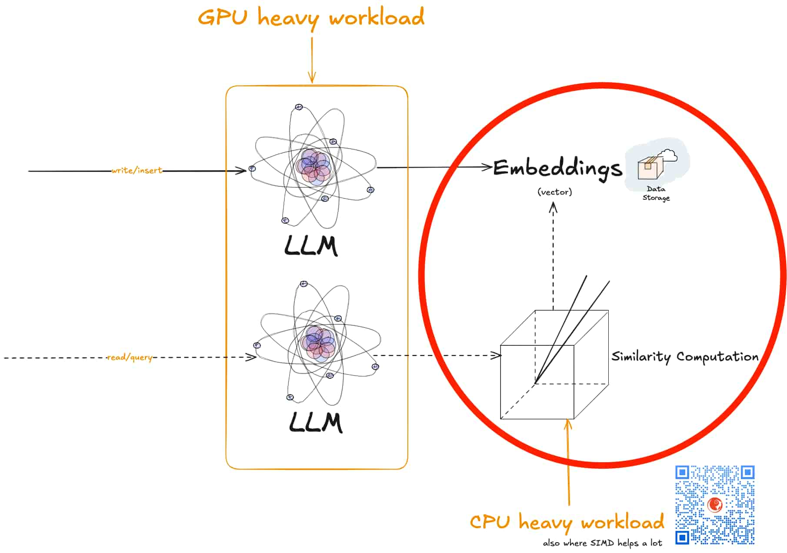
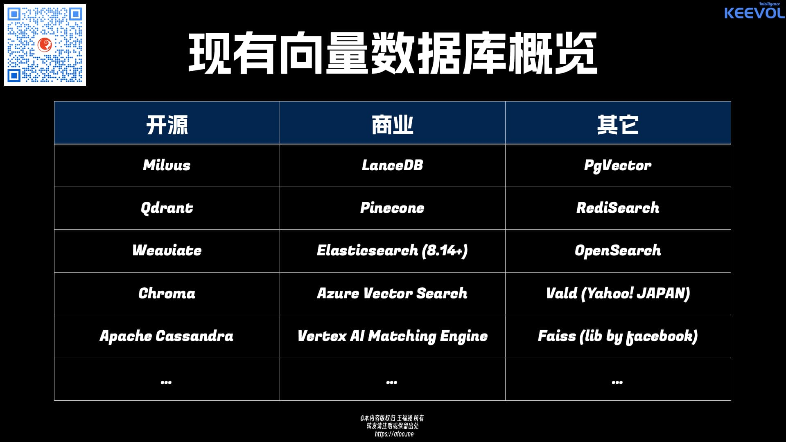

% 向量数据库能解决AI系统不够智能的问题吗？
% 王福强
% 2025-09-05

前几天有老总问：

> 飞书很重视知识管理，但都是从文档中检索，感觉还不够智能。是不是用你这数据库后能解决？@王福强@福强科技 

他提到的“你这数据库”是指我上个月开始折腾的 [KVectors 向量数据库](https://github.com/fujohnwang/kvectors)。

我的回复是：

> 解决不了，智能是个系统工程 ；）

只能说， 向量数据库属于构建智能系统的一份子，但你让它单个挑大梁成就整体智能，那有点儿太难为他了。

而且，从打算搞KVectors开始，我就没期望说它能支撑起整个AI的天。

它就只专注一个点，向量的管理（存储与相似度检索），甚至于向量的生成它的不管🤣

它存在的唯一目的，就是能够快糙猛（其实也没那么糙）地满足小众场景里的AI需求，比如相似问题的重复回答、用AI技术重新实现的以图搜图等等。

要说通用智能和“足够”智能，这投入可就大了去了，岂是我这种 one-man army 可以干的事情？ 

要知道，越通用的方案，往往越需要更多的抽象和拼接，投入和周期都是无法准确估算的，没有点儿马云老师那种远见，谁tmd干这么砸钱？

我老早就说了，什么AI IaaS、AI PaaS甚至MaaS，让大厂去搞得了，SMB凑啥热闹嘛， 搞搞应用、搞搞业务场景AI化不香吗？

技术只是商业活动中一环，或者一种能力，但商业活动还有很多因素需要融合，从这个角度来说，KVectors跟通用AI智能的关系，倒是有点儿跟技术和商业的关系很像了。

一个是点，一个是面或体，不可同日而语。

不过可以同台唱戏🤣

其实向量数据库的选择挺多的， 我在给企业做向量数据库培训的时候，PPT的第一页就把所有常见的产品罗列出来了：

只是技术选型拿来用，基本上差不多的，latency上差不了多少毫秒。

但假如你想知道底层机理以及周边所有的AI基础设施和理论，那能挖的东西就多了去了。

一个点深挖下去，也可以很深的🤪

哦，对了，这个培训对企业开放，欢迎感兴趣的企业洽谈预约。

[福强企业培训全家桶 之 向量数据库架构设计与实现](https://keevol.cn/t){target="_blank"}

