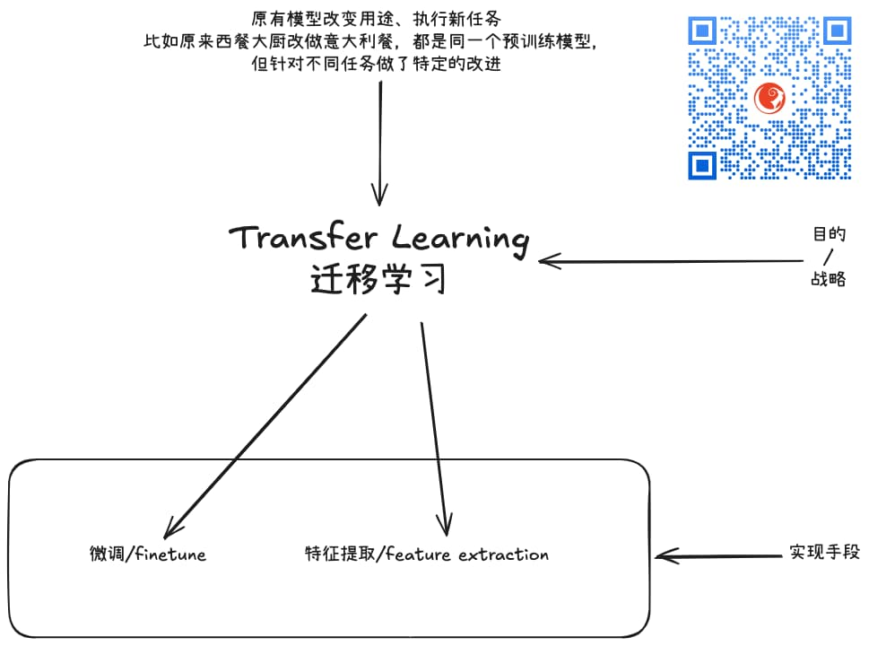

% 别用AGI的预期去要求LLM
% 王福强
% 2025-09-09

## 术语

### AGI

AGI 即 Artificial General Intelligence， 人工通用智能

> In the context of technology and AI research, this refers to a hypothetical machine intelligence with the ability to understand, learn, and apply its intelligence to solve any intellectual task that a human can.

也就是AI到了一个人能干的事儿，它也能干的程度。

### LLM

LLM 即 Large Language Model, 大语言模型，现在一般都简单称“大模型”

属于NLP（自然语言处理）范畴内的工程结晶，而NLP又只是AI这个大范畴里的一小块。

### SMB

Small to Medium-Sized Business , 中小型企业

## 缘起

这几天尹总在群里表达了自己被AI伤透了心的“愤慨”之情：

> 我越来对LLM越没信心了，还是感觉传统比较靠谱。

其实，相对来说，大模型还是带来了一些不小的变动， 不要因噎废食嘛，预期太高，还是因为搞营销的这帮人把AGI抬的太高了，但实际上现在的大模型远没有达到AGI的水平。

## 实际

昨天恰好在梳理一张图：

其实今天要用好大模型，最主要的一个关键点是： 先要搞清楚自己的目的（对大模型来说是task）， 然后再根据task挑选适合的（大）模型。

有的模型是一个模型只负责处理一个task，有的模型是一个模型可以处理多个task，但不管怎么样，先task，再模型，而不是先模型，再task

这几天TVP的架构师群里恰好也在讨论一个话题，就是Vibe Coding到底在企业里落地的怎么样了

发现很多做ToB的企业，反而在用小模型，哈哈哈

这倒是跟我的体验一致的，从理论上可以跟企业将明白现在哪些事情（用AI）可以做了

但具体落地的时候，大模型的使用成本对于企业来说（尤其是SMB）其实还是会很“敏感”， 前阵子调研文本与图像嵌入的轻量级模型，其实也是因为成本这方面的原因。

还有就是，工程领域跟情绪价值领域对大模型的要求也是不一样的。

情绪疗愈对话可以让大模型从“固定话术”池子里随机应变， 无关事实，只要让魔镜前面的人觉得自己是这个世界上最美的女人就行了。

但工程领域不行，工程领域要的是事实与确定性。

所以，即使现在AIAD（AI辅助开发）已经很让开发人员沸腾了，但还是会通过设计研发流程（比如加入AI相互review以及人工审核与审计）来规避概率性系统天生的缺陷可能导致的问题。

但不管怎么样，这东西确实带来了研发效率的提升（适合得当的话）。

所以，最后搬出n年前谈AI的一个观点作为结尾： **push it to the limit**， 即使这货有这样那样的缺陷。 🤪

我说的不因噎废食，是这个意思。

