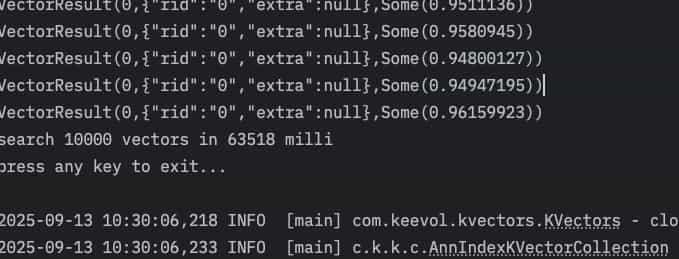

% KVectors 压缩向量搜索重要跑通了...
% 王福强
% 2025-09-13

blocking了半个月，终于通过读原始代码解决了KVectors绕不过去的一个大坑...

之前总是segment fault， 这错误让我这种对操作系统和硬件比较打怵的人来说，有点儿抓瞎😂

不过，这个问题不解决，一直block在那儿也不行，给依赖类库也提交了issue，作者没屌我，可能觉得问题太小儿科，或者海外工作节奏比较闲适? 🤪

问AI其实更无解，最后只能自己啃依赖库的源代码，昨天发现苗头儿，今天修改验证后，一切OK了 ✅

用Sift的数据集做的测试（128维向量）

从100万条向量数据中查询1万条简单跑了下，数据看起来还可以， 平均6.3毫秒

而且是在2019年的老 MacbookPro 上跑的...

#KVectors #向量数据库

