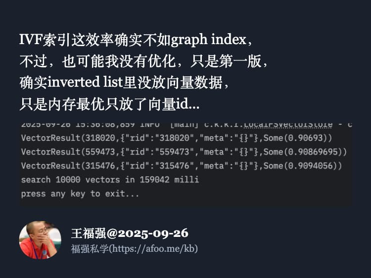
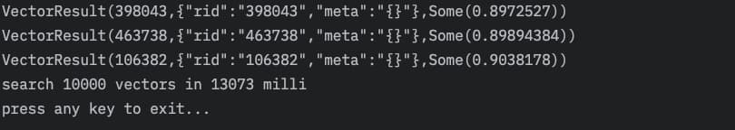
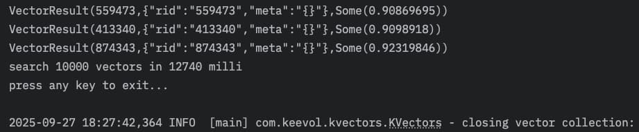
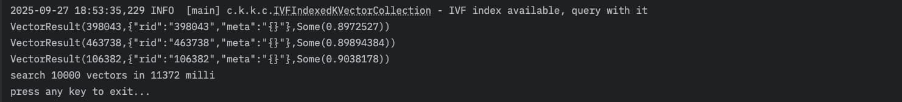
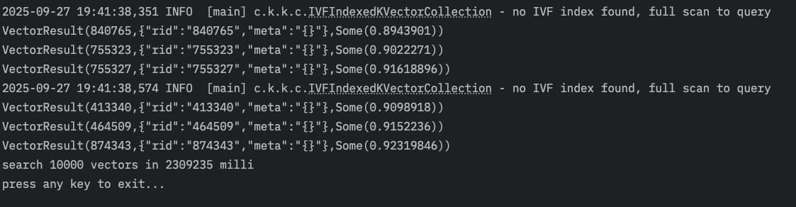

% KVectors向量数据库IVF索引，这测试结果我自己都想不到...
% 王福强
% 2025-09-27

测试数据集是Sift的100万向量数据， 向量维度是128维。

第一版的数据先作为基准，大家先有个感性对标：

从Sift的这100万向量数据集中查询一万条向量，一共用时159042毫秒（ms）， 平均15.9毫秒， 跟KVectors里提供的HNSW+DiskANN版本查询性能相比，差八九毫秒，不过，也还不错，因为我第一版并没有严格按照IVF索引的语义进行的设计和实现，即向量数据我没有全都搬到内存里存放。

所以，从这角度来说，IO层面应该还有很大的提升空间。

于是，我就在重构完KVectors第三个版本的整体设计与实现之后，为向量存储新增了 loadAllVectorsIntoMemory 这个选项，并把它的默认值设置成了true，毕竟，现在生产服务器的内存轻轻松松就能搞定百万级别的向量数据存储。

搞定之后， 下面是几次粗略测试的结果截图（粗略测试是因为，我只是在2019年的老Intel MacbookPro上跑的这个测试）：

一开始我没细看，以为省了几毫秒，细看发现， 这tmd平均不到2毫秒啊！！！

1.1毫秒到1.3毫秒...

我都没想到有这么惊喜，那看来HNSW+DiskANN版本也有很大提升空间咯～

后来，为了再看看没有构建IVF索引之前查询同样数据会是怎么样一个结果，我又跑了下（当然，还是全量数据放内存）：

性能急降，平均单次查询直接给干到了230毫秒， 😂

所以，IVF索引功不可没啊！

另外，感谢王总预约了下个月的新培训，感兴趣的企业也[欢迎预约](https://keevol.cn/trainings.html)哟～

