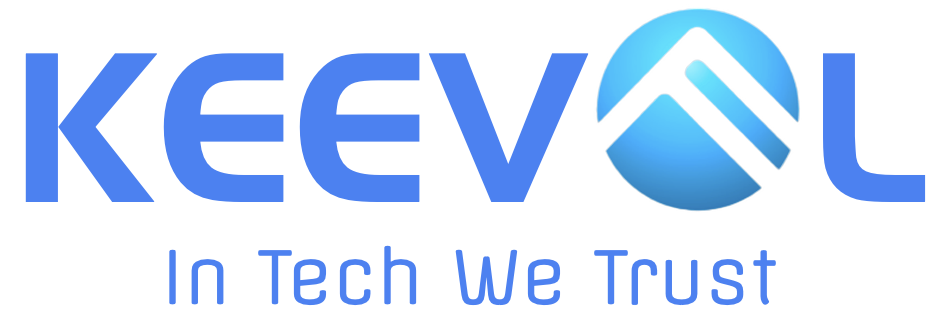

% 十年
% 王福强
% 2025-10-15

看这标题是不是想起陈奕迅的那首《十年》？

其实

我就是借这个词儿感叹下

谁让很多事情在这个词儿下面撞车了呢

有兄弟这阵子一直念叨要买我那辆老奔子

昨天又念叨

才发现，这车也10年车龄了...

今天果总群里又跟始祖鸟过不去了（当然，还跟东bell家也一直过不去🤣）

其实，作为拥有两件始祖鸟的买家

我觉得始祖鸟挺好的

第一件红色软壳，想来也**10年**左右了

当年好像是看到51信用卡原CEO孙海淘穿了件始祖鸟T恤

回来查了下这个牌子后买的。

有时候背着11寸的macbook air出去讲课

经常被问这电脑有年头儿了吧？

嗯，应该也超过**10年**了...

很多东西，初看起来好像很贵

但回头再看

平均下来其实远比平均价钱买的“短命鬼”要划算很多

更不要说频繁的筛选成本和情绪消耗...

品牌这东西

看似很玄乎

但其实确有其价值

当你为各种低价款埋过单、被各种低价坑过之后，你就会理解品牌的价值了。

品牌其实帮我们屏蔽了选品的成本与风险，稍有溢价也是合理的。

品牌是什么？ 品牌是你长期信用的积累。

伟大的公司，始于产品，终于品牌。

很多年前，我跟成哥聊天的时候说

我就算趴着，这家也得做10年

嗯，还有两年就快到了，加油，😂

