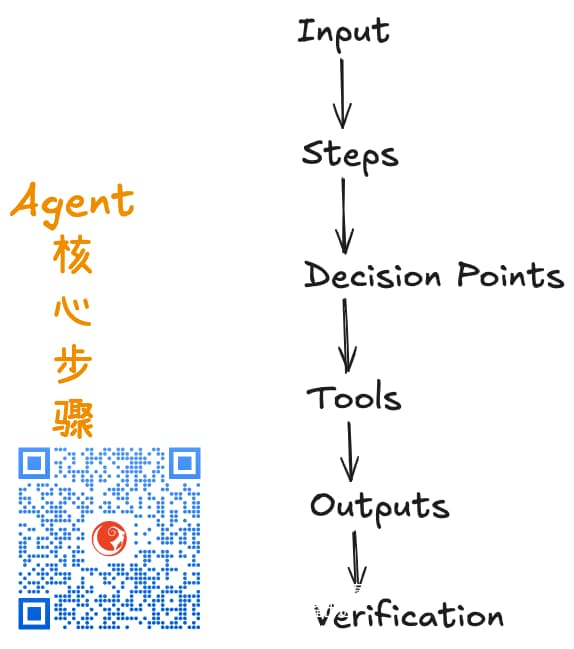

% 跟着福强老师一分钟了解Claude Skills
% 王福强
% 2025-10-19

读官方文档是最直接的：https://www.anthropic.com/news/skills

> Claude can now use Skills to improve how it performs specific tasks. 

这句话说明，Skills是面向特定任务的设计。

> Skills are folders that include instructions, scripts, and resources that Claude can load when needed.

这句话说明了Skills的交付和组织形式，就是个目录，目录里包含了指令（md编写的，AI友好嘛）、脚本和需要的资源。 Claude可以按需加载目录里这些东西。

> Claude will only access a skill when it's relevant to the task at hand. When used, skills make Claude better at specialized tasks like working with Excel or following your organization's brand guidelines.

这个遵循组织的品牌指南挺好，一致性才是根本。

> Now, you can build your own skills and use them across Claude apps, Claude Code, and our API.

可以在Anthropic家的产品上通用。 估计马上其他家就会有类似的概念和组件出现了🤣

> While working on tasks, Claude scans available skills to find relevant matches. When one matches, it loads only the minimal information and files needed—keeping Claude fast while accessing specialized expertise.

Skills这个frontmatter + body的行为设计，跟Scala里的Partial Functions很像，也就是必要匹配之后才会执行主体逻辑。从AI Agent角度它是为了省tokens，但从程序逻辑角度，其实就是条件匹配（predicates）。

这种设计还有个好处就是级联，比如，在[KVectors向量数据库](https://keevol.cn/#kvectors)启动的时候，根据不同向量集合类型初始化的时候，用Partial Function的设计就可以实现优雅的级联：

```scala
    val vectorCollection: KVectorCollection = Option(collectionDir).collect(IVFIndexedKVectorCollection orElse HyperplanesLshKVectorCollection) match {
      case Some(vc) =>
        logger.info(s"collected from specific collection partial function: ${vc.getClass}")
        vc

      case None => ...
    }
```

而Claude Skills，其实就是把条件检测+逻辑+级联的设计思想应用到了AI Agent的设计之中（也就是Claude的自家产品中）。 

> Skills are Composable: Skills stack together. Claude automatically identifies which skills are needed and coordinates their use

这里的composable就是级联， identify就是条件检测（predicates）。

> (Skills are) Efficient: Only loads what's needed, when it's needed.

也就是匹配之后才执行， 跟PartialFunction的定义Perfect Match

> (Skills are) Powerful: Skills can include executable code for tasks where traditional programming is more reliable than token generation.

把MCP提供的原子能力本地化，可以融合自然语言和程序语言形成一个独立的模块。毕竟，程序语言比token生成更可靠，能用为啥不用？🤪

那Skills跟MCP有啥区别呢？

> MCP connects Claude to external services and data sources. Skills provide procedural knowledge—instructions for how to complete specific tasks or workflows. You can use both together: MCP connections give Claude access to tools, while Skills teach Claude how to use those tools effectively.

简单来说，IMO，MCP提供原子能力，怎么用这些原子能力，Skill是可以模块化的方式封装和使用。当然，如果只是本地需求，也可以在Skills里写脚本，这时候也不一定非得用MCP调用外部能力。


当然，有人把Skills类比为SOP（Standard Operating Procedure/标准作业流程），这个嘛，也可以这么理解：



只不过，就算是SOP， 它其实也是模块化内部的SOP，也就是完成一个任务（Task）所需的步骤。

福强老师觉得，这东西会是继MCP之后，另一个会在业界快速流行的AI生态一员。


## Ref

- https://support.claude.com/en/articles/12512176-what-are-skills
- https://www.anthropic.com/engineering/equipping-agents-for-the-real-world-with-agent-skills
- https://github.com/anthropics/skills