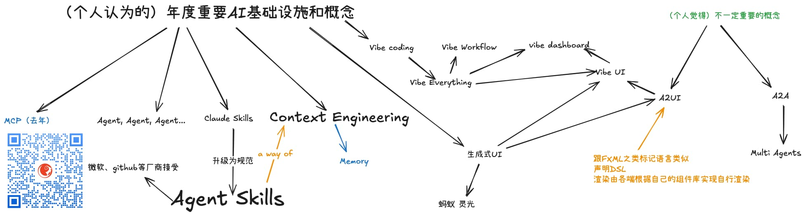
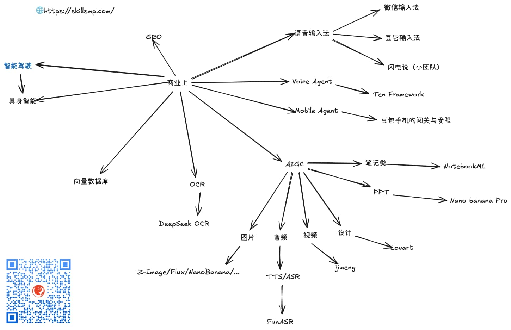

% 2025 年 AI 小结 与 2026 年 AI 展望
% 王福强
% 2025-12-24

以下所有内容均福强老师个人观点，有失偏颇也好，胡说八道也罢，总之概不负责真假对错，各位看官自行甄别。

## 2025 年度重要 AI 概念

### MCP

这个年度给某运营商全国CIO培训的时候提到过，我标注成非正常颜色只是因为我觉得这个是常识了。

### Agent

嗯，都在喊Agent 元年，所以，Agent 肯定算是2025 年度概念。

### 从 Claude Skills 到 Agent Skills

Skills这个概念之所以重要在于，它以 AI Agent 友好的方式提供了能力的“模块化”支持。这东西的重要性就算是传统软件研发也能理解，因为模块化、复用/重用、服务化、单元化...， 所有这些概念的本质，其实就是模块化。

开始只是 Claude 一家在自己的Agent里用并分享出来，后来各家企业纷纷采纳，所以，到今天，直接升级成了Agent Skills规范，这样，AI产业界就都可以从中受益了，互联互动，总是可以避免不必要的重复建设，让用户受益的。

相对于Agent，我更喜欢Skills这个年度概念，因为它更工程务实。

### Context Engineering

这个概念也是2025年里一个重要的AI概念，相对于Prompting Engineering, Context Engineering已经从一个点扩展为去关注系统性的大模型curate策略和方案了。

而之所以前面说Skill是个好东西就在于，它其实就是Context Engineering这个大概念下的一个最佳实践。 

Context Engineering如果算概念和口号，那Skill算最佳实践和落地举措。

当然，这个大概念下，也同样覆盖了 Memory 管理这些相关概念和举措。

### 生成式UI

咋说呢？

就是顺带一提吧，我觉得没（自）媒体吹的那么玄乎，响应的， 我也没觉得像A2UI这些概念有多好，用肯定会有人用，就跟菜系一样，不同人不同口味而已，我不感冒。

A2A和Multi Agent也属于我不感冒的一类， 它俩的出现也早于A2UI。

### Vibe Everything

这个就有意思了， Vibe Everything 是我总结的

从Vibe Coding这个概念开始， 

什么Vibe Workflow啦， Vibe Dashboard啦， Vibe UI啦（包含了Vibe Dashboard这类更具体的场景）， 总之就是动动嘴，剩下的活儿交给AI干就行了。

尤其是下面会提到，巨头们在2025年争抢AI语音输入法这块阵地，也是为Vibe Everything争抢入口。

## 大模型

大模型继续酣战

海外亮眼的有：

- Claude家的Sonnet4.5/Opus4.5等
- Open AI的GPT 5.2
- Google家的Gemini3和Nana banana pro
- xAI的Grok4.1
- 还有一些周边厂家，比如Mistral还在继续参与游戏

国内亮眼的有：

- 阿里的Qwen3
- 字节的
- GLM4.7， 主打一个对标claude家的代码模型第一名
- Minimax的M2/M2.1
- Kimi K2
- 小米也刚发布了Mimo flash， 我用它折腾了一天半的keenotes开发，怎么说呢，效果上跟claude家的代码模型还是有不少差距

## AI Agent框架

这个其实没啥太大新意了，自己习惯什么、熟悉什么计算机语言就选相关的框架就好了。

比如你熟悉python，那老牌儿的langchain这些肯定ok

假如你熟悉java，那从Spring AI 到 langchain4j，甚至是Spring框架之父新搞的Embabel也值得一试（个人不喜欢，因为对annotation没啥好感，哈哈哈）

## AI Agent 平台

开源的：

- 老牌n8n值得信赖（新出了个致命的安全漏洞，记得升级哟）
- dify
- coze（从闭源到开源）

还有很多不同公司AI Agent平台，像google的gems， lovable， v0这些，都算。

## 其它 AI Agent 规范与实践

除了前面提到的Agent Skills，再提一个durable streams，大家可以看看

## AI商业

反正各行各业都在拥抱AI，我也不是啥行业都熟悉，就简单罗列了些，大家随便看看吧：

里面投入精力最多是向量数据库，因为如果你关注我时间比较长，应该知道我写了个KVectors向量数据库，所以，过程中肯定不少精力耗费在向量数据库这个细分领域。

## 2026的 AI 会怎么样

说实话，

真不知道，

反正方向是没问题的。

且行且看吧～

