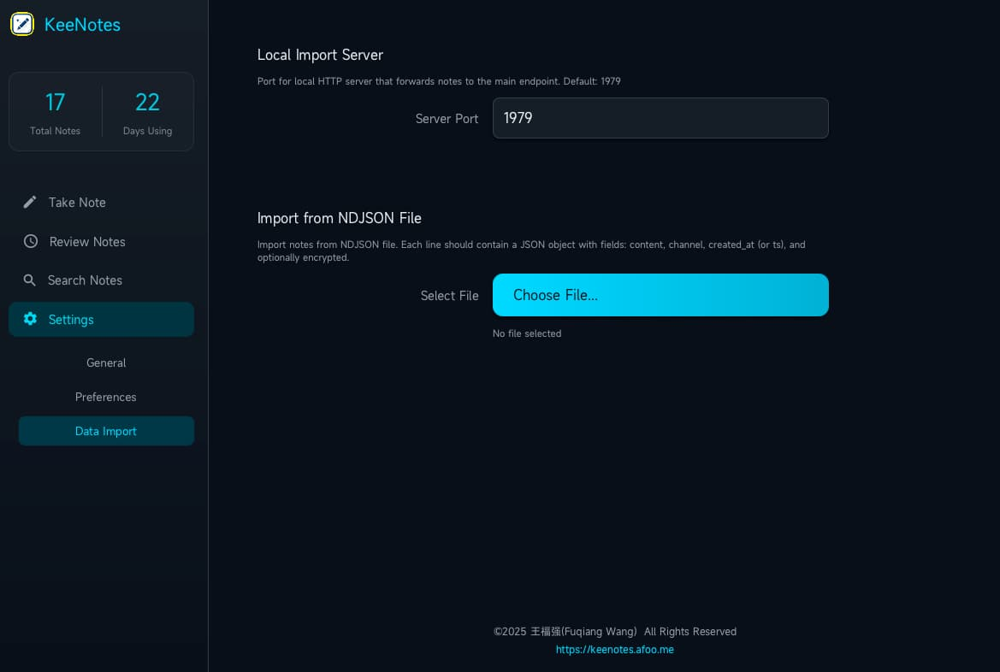

% KeeNotes 桌面版支持本地数据导入啦～
% 王福强
% 2026-01-25

[Keenotes](https://keenotes.afoo.me) [新发布的 V1.3.4.26 版](https://github.com/fujohnwang/keenotes-releases/releases) 支持用户从本地导入自己之前的闪念，不管是自己持有的，还是其它软件的。

通过桌面版KeeNotes，你有两种方式导入数据（从而在所有端上都可以访问）：

1. 使用本地API导入
2. 在`Settings -> Data Import` 选择本地NDJSON文件导入


## 使用本地API导入

桌面版KeeNotes在本地开放了一个简单的数据导入API：



默认端口开在1979，你可以根据自己喜好更改这个端口（或者因为本地端口冲突？）。

API的使用其实也很简单：

```bash
http localhost:1979 content="API test for local import server" channel="cli" created_at="2024-10-24 11:11:01"
```

即以POST形式发送JSON格式的Payload即可， JSON必要字段如上所示:

- content：闪念内容主体
- channel：来源或者分类
- created_at：创建时候的时间戳

还有一个可选字段是*encrypted*，主要针对导入其它KeeNotes服务器的数据的场景，对于普通用户来说，一般不需要了解。

## 择本地NDJSON文件导入

KeeNotes桌面版支持的第二种数据导入方式是，允许用户选择本地文件批量导入。

文件格式是NDJSON格式，这个格式其实也不复杂，所谓NDJSON格式，其实就是一行一个JSON对象。 

比如：

```
{"content": "test content/测试内容","channel":"data_import","created_at":"2024-10-25 11:25:00"}
{"content": "test content/测试内容2","channel":"data_import","ts":"2024-10-25 10:35:00"}
...
```

用户如果想把其它系统的数据导入KeeNotes， 只要将原系统的数据导出为NDJSON格式，然后在KeeNotes桌面版的`Settings -> Data Import`界面选择目标NDJSON文件，KeeNotes桌面版就会自动在后台开始数据导入的任务了。

NDJSON每一行JSON的内容和必要字段，跟[使用本地API导入](#使用本地API导入)使用的格式一样。(不过也多个可选项，就是created_at字段也可以用ts字段代替，这两个字段在NDJSON这里代表时间戳字段都可以)

比如， 假如我要把自己原来keebox里的闪念导入keenotes，我直接用下面的命令导出NDJSON就可以了：

```bash
sqlite3 -list -noheader "notes.sqlite3" "select json_object('content', content, 'channel', channel, 'created_at', created_at) from notes;" > out.ndjson
```

因为原来的数据就是sqlite3数据库存储，所以，直接使用sqlite3的json_object函数导出就可以了。

至于对于用户你来说，AI时代，不知道怎么把老数据转成NDJSON，直接交代AI去干就好了，原本它也适合干这个 `^-^`

## 写在最后

经常遇到有人问 keenotes 跟其它同类软件有啥差别，其实个人也没特别想要去做这方面的对比， 把这个东西做出来，纯粹是自己实践了（或者说毫不费力地坚持了）9年，觉得应该有人会有类似的需求，所以才开始正式打磨出来。

如果你实在想做个对比，可以看看这篇简单介绍，自己对比吧🤣

[https://mp.weixin.qq.com/s/eLSm7OqUiny66LuPZaCNQw](https://mp.weixin.qq.com/s/eLSm7OqUiny66LuPZaCNQw)


