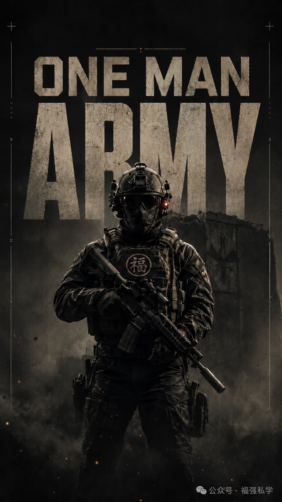

% 一人军队（OMA），如何玩转 Vibe Coding？
% 王福强
% 2026-09-07

## 从“让 AI 写代码”到一套可控的软件生产方式

这几年，“一人公司”越来越流行，也就是 OPC（One Person Company）。

但我其实还挺喜欢另一个更早的说法：

**OMA，One Man Army。**

一个人的军队或者就是一人军队。

它强调的不是“公司只有一个人”，而是一种更强烈的状态：**一个人，却拥有完成一整套任务的能力。** 或者更大粒度的，**完成整个目标交付的能力**， 从产研到销售和服务。

过去想做一个稍微完整的软件产品，往往需要产品、设计、前端、后端、客户端、测试、运维等不同角色。现在，随着 Coding Agent 的能力越来越强，一个人能够覆盖的范围正在迅速扩大。

我自己已经做了不少工具软件，包括 [KeeNotes](https://keenotes.afoo.me/)、[FooSnippets](https://foosnippets.afoo.me/)、[FooCloud](https://keevol.cn/#fscloud)、[RMBG](https://afoo.me/rmbg/) 等，更有多款产品已经进入 Apple App Store 的发布流程。

最主要的是，Tooling 本身也是整个 [KEEVOL](https://keevol.cn/) TEC 体系的一部分：工具软件、技术教育和战略咨询，构成了一套相互支撑的事情。（我叫这个战略愿景为**KEEVOL Troika**）

当 KVectors 向量数据库成为个人古早手工编码时代的最后一个高质量交付的产品之后，

从 2026 年开始，我的软件开发方式发生了一个非常明显的变化，即开始了 **Vibe Coding**（Everything）。

---

## 从 Panic 到 Hug

很多有多年开发经验的人第一次真正面对 Vibe Coding，多少都会经历一点心理冲击，而我就经历了一个如下的过程：

**Panic → Hug。**

从恐慌，到拥抱。

恐慌其实很好理解。

我们几十年来形成的软件工程习惯和个人能力，本质上建立在一个前提之上：

> **代码很贵**

代码需要人一行一行写，框架需要人学，API 要查，跨平台意味着重新学习另一套技术栈，一门新语言可能要花几个月才能熟悉。

因此，我们过去的软件工程里，有大量决策，其实是在优化“人写代码的成本”。

为什么强调跨平台？

因为 Android 写一套、iOS 再写一套太贵。

为什么希望前后端都用一种语言？

因为维护两三套语言体系太贵。

为什么如此强调代码复用？

因为重新写一遍太贵。

可是 Coding Agent 出现以后，一个极重要的变量发生了变化：

**代码的生产成本突然量级般地下降了。**

这时候，如果依然机械地沿用过去所有“为了减少写代码而产生的最佳实践”，未必还是最优解。

这也是我这一段时间 Vibe Coding 最大的体会，下面是个人Vibe Coding过程中总结的一部分个人认为的最佳实践，与大家分享。

---

# 第一条个人最佳实践：MonoRepo

我的第一条实践非常简单：

**MonoRepo。** 

传统团队为什么经常把项目拆成很多 Repository？

因为不同团队负责不同部分。

前端一个 Repo，后端一个 Repo，iOS 一个 Repo，Android 一个 Repo，基础设施可能还有一个 Repo。

这是一种很典型的**组织结构映射到代码组织结构**的方式。

但 OMA 的情况不同。

如果一个产品本来就是一个人加若干 Agent 在维护，那么人为把它切成七八个仓库，反而会产生额外的上下文成本。（还记得**微服务**吗？🤪）

对于 Coding Agent 来说，这一点尤其明显。

假设一次需求同时需要修改：

Web 前端、API、数据库 Schema、macOS 客户端和部署脚本。

如果它们都在一个 MonoRepo 里，Agent 可以直接看到整个系统。

数据库字段改了，它能够顺着依赖关系找到 API；API 改了，又可以继续找到客户端。

所以，对 OMA 来说，MonoRepo 不只是代码管理风格。

它实际上在做一件更重要的事情：

**把系统尽可能完整地放进 Agent 的可见范围。**

换句话说，过去 Repository 经常围绕“人和团队”划边界；到了 Agent Coding 时代，Repository 还要开始考虑：

> **怎样划分，最有利于机器理解整个系统？**

这是两个完全不同的出发点。

---

# 第二条个人最佳实践：Hierarchy Context Files

有了 MonoRepo，还只是让 Agent **看得到代码**。

但看到代码，并不代表它理解你的意图。

所以第二个个人的最佳实践是：

**Hierarchy Context Files。** 

Coding Agent 有一个非常现实的问题：

它每次进入项目，都需要重新建立上下文。

这个项目为什么这样设计？

技术栈是什么？

哪些东西绝对不能动？

命名规范是什么？

UI 应该遵循什么风格？

某个子模块为什么故意没有采用通常的实现方式？

如果这些东西只存在于你的脑子里，Agent 每一轮都得重新猜。

所以，一个适合 Agent 的代码库，不应该只有代码，还应该有一套**层级化的上下文体系**。

比如在最顶层描述整个项目的目标、原则和架构约束；进入具体模块以后，再补充这个模块自己的规则；再往下，还可以有更加局部的约定。

于是形成类似：

**Global Context → Project Context → Module Context → Task Context**

这样的层级。

这里有一个很重要的原则：

> **上下文应该尽可能靠近它所约束的对象。**

全局规则放全局。

macOS 的规则放 macOS 目录。

某个服务的特殊约束就放在那个服务附近。

这样做的好处，不只是节约 Token。

更重要的是，它开始把过去存在于程序员脑子里的**隐性知识显性化**。

这其实是 Agent Native Software Engineering 很重要的一步。

---

# 第三条个人最佳实践：PairLoop

接下来是我很看重的一个词：

**PairLoop** 

很多人理解 Vibe Coding，会想象成：

> “我把需求告诉 AI，然后 AI 把程序写完。”

真正工作以后你会发现，这种模式通常并不好用。

Vibe Coding 更像以前的 Pair Programming，只不过你的 Pair 从另一个程序员变成了 Coding Agent。

而且这个过程不是一轮，是一个 Loop。

把它展开，大概就是：

**意图 → 实现 → 运行 → 验证 → 反馈 → 修改 → 再运行。**

然后不断循环。

这里真正重要的并不是 Prompt 有多完美。

事实上，我越来越不相信所谓 “一条神 Prompt 把事情搞定”。

复杂的软件系统不可能靠一次描述就穷尽所有细节。

真正可靠的方法是：

**缩短反馈环**

让 Agent 做一点。

马上运行。

看到问题。

马上修正。

然后再进入下一轮。

因此，Vibe Coding 的效率并不只取决于：

**Agent 一次能生成多少代码**

更取决于：

**你和 Agent 一天能完成多少次有效闭环**

这个区别非常重要。

当然，这里的 Pair 也可以是 Agent 和 Agent 组 Pair，不一定是你和 Agent 组 Pair，甚至组合成两个甚至更多的层次，并不冲突。

---

# 第四条个人最佳实践：Multi-Platform over Cross Platform

这是一个我觉得非常有意思的变化。

过去十几年，客户端开发有一个强烈趋势：

**Cross Platform**

能不能一套代码跑 iOS、Android、macOS、Windows？

它背后的逻辑非常合理：

开发两个/多个平台的版本太贵，所以最好只维护一个版本。

但 Vibe Coding 之后，我越来越倾向于：

**Multi-Platform over Cross Platform** 

注意，这两个词看起来很像，思路却完全不同。

Cross Platform 追求：

> **一套实现运行在多个平台。**

Multi-Platform 则接受：

> **每个平台都可以有最适合自己的实现。**

以前后者的问题是**成本**。

Swift 写一套，Kotlin 写一套，Web 再写一套，维护成本太高。（甚至人你都找不到，除非你一起手就是大厂）

但当 Coding Agent 可以帮你承担大量实现工作以后，这个成本结构发生了改变。

这时候，与其为了共享代码，让所有平台迁就某一个抽象层，不如：

以 iOS 的方式和技术栈做 iOS 应用，

以 macOS 的方式和技术栈做 macOS 应用，

以 Web 的方式和技术栈做 Web 应用...

真正共享的，可以是产品定义、协议、数据模型、设计规则和业务逻辑描述，而不一定非得共享每一行实现代码。

AI 实际上让“重复实现”第一次变得没那么可怕。

---

# 第五条个人最佳实践：Multi-Lang over Single Lang Ecosystem

同样的变化，也发生在编程语言上。

所以第五条是：

**Multi-Lang over Single Lang Ecosystem。** 

以前我们很喜欢所谓 One Language Everywhere。

比如：

前端 JavaScript，

后端也 Node.js，

工具也 JavaScript，

这样整个团队只需要掌握一种语言。

它最大的好处，还是降低人的学习和切换成本。

但 Coding Agent 并没有这么强的“语言洁癖”或者说“语言壁垒”。

今天写 Swift，下一分钟写 Rust，再下一分钟改 TypeScript，对 Agent 来说并不像人一样需要重新学习个半年。

于是技术选型可以逐渐回到一个很朴素的问题：

> **这件事情，用什么计算机语言做最合适？**

macOS 原生 App 用 Swift。

某个高性能组件用 Rust。

Web UI 用 TypeScript。

一些自动化任务用 Python。

服务器再根据实际情况选最适合的语言。

过去 Polyglot Programming （多语言混合编程） 最大的问题之一是认知成本。

而 AI 正在显著压低这个成本。

所以未来软件系统可能反而会变得**更多语言，而不是更少语言**。

只不过复杂性的一部分，从“人必须熟悉所有语言”，转移成了：

**人必须对问题的边界和语言的匹配度作出合适的决策**

---

# 第六条个人最佳实践：广域网验收，局域网交付

这背后的思路其实也是在优化反馈 Loop。

开发过程中，最重要的是让东西尽快被看到。

因此验收环境应该尽可能容易访问。

一个功能完成以后，不要让对方先装环境、VPN、依赖和各种工具才能看。

最好给一个地址，打开就能验。

这是**广域网验收**。

但最终真正交付的时候，尤其企业内部系统或者私有化软件，完全可以进入客户自己的局域网或者内部环境。

这是**局域网交付**。

把“验收”和“最终部署”拆开，解决的是两个不同的问题：

验收追求**低摩擦反馈**；

交付追求**安全、私有和可控**。

如果把二者强行绑定在一起，反馈周期往往会被部署复杂性拖慢。

而 Vibe Coding 最怕的，就是 Loop 太长。

---

# 一个更深的变化：Reuse VS. Distill

传统软件工程非常强调 Reuse。

不要重复代码。

做公共组件。

做公共库。

抽象框架。

沉淀基础设施。

这是因为：

**代码贵，所以代码值得重复利用。**

但 Vibe Coding 以后，我们可能需要重新思考：

真正应该重复利用的，到底是什么？

比如我刚刚完成一个非常好的 macOS 权限授权流程。

过去第一反应可能是：

**把这套代码抽成 Framework。**

但在 Agent 时代，另一种做法可能更有价值：

把这次实践里真正有效的东西提炼出来：

设计原则是什么？

哪些 API 容易踩坑？

正确流程是什么？

交互应该怎样设计？

哪些异常情况必须处理？

然后把这些东西沉淀成一份 Context、Spec、Skill 或 Pattern。

下一次，再让 Agent 根据新的项目重新生成最适合那个项目的实现。

这就是：

**Distill，而不只是 Reuse。**

Reuse 是：

> 复用上一次的代码。

Distill 更像是：

> 复用上一次获得的认知。

代码是某一次问题求解的结果。

而被提炼出来的知识，则可以继续生成许多不同的结果。

AI 让“重新生成代码”越来越便宜以后，后者的价值会越来越高。

---

## 最终原则：More Loops, More Certainty

综合整套最佳实践，我把它总结成一句话：

**More Loops, More Certainty.**

也就是**更多轮次，更多确定性。** 

这其实也是我现在理解 Vibe Coding 最核心的一点。

很多人担心 AI 写代码不可靠。

这个担心没有错。

但解决方案并不是要求 AI：

**一次就必须百分之百正确。**

软件开发本来也不是这样工作的。

真正能够制造确定性的，从来都是反馈：

编译一次。

跑一次。

测试一次。

看一次 UI。

部署一次。

让真实用户操作一次。

发现问题。

然后再修。

AI 最大的价值，并不是消灭这些 Loop。

恰恰相反，它让每一次修改的成本急剧下降，因此我们终于可以：

**跑更多 Loop(s)**

如果以前修改一个方案需要两天，那么大家倾向于修改之前讨论半天。

现在修改只需要十分钟，那最经济的方式可能变成：

先做出来。

跑一下。

不对就改。

再跑。

这是一种完全不同的软件生产经济学。

---

# Vibe Coding 并不是“不懂代码也没关系”

最后还要澄清一个容易产生的误会：

当代码越来越多由 AI 生成时，并不意味着工程能力变得不重要。

恰恰相反。

过去，你的能力决定：

**你能写出什么。**

现在越来越变成：

**你能判断什么是对的。**

架构有没有问题？

技术选型合不合理？

平台体验是不是原生？

数据模型有没有埋雷？

安全边界在哪里？

Agent 是在解决问题，还是只是绕开问题？

这些事情最终仍然需要人来判断。

所以 OMA 并不是：

> 一个人什么都亲自干。

更准确的定义可能是：

> **一个人能够对完整结果负责。**

AI 可以写代码，可以跑命令，可以修改 UI，可以修 Bug。

但方向、边界、取舍和最终验收，仍然在 Builder 手里。

而这，大概也是 Vibe Coding 真正有意思的地方。

它首先改变的不是编程语言，不是 IDE，也不是某一种模型。

它改变的是：

**一个人可以完成多大范围的软件工程**。

以前我们靠组织扩大能力，

现在，一个 OMA 也可以靠 Agent 扩大能力和个人边界。

至于如何让这种能力变得稳定，而不是变成一场随机的“AI 抽卡游戏”，我的答案依然是：

> **More Loops, More Certainty.**

循环得足够快、足够多，反馈足够及时，结果就会越来越确定。

最后，祝大家 **Happy Vibe Coding**。
